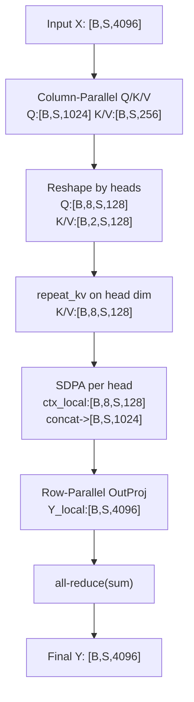

<!-- more -->


---

> 例子配置（贯穿全文）：
> `hidden_size=4096, num_attention_heads=32, tensor_parallel_size=4, num_query_groups=8（GQA）, kv_channels=hidden/heads=128`。
> 输入形状用 `[B, S, H]` 记（批、序列、隐藏）。

---

## 1. 名词与派生变量（先把量算清楚）

* 单头维度（也是缩放用的 $d_k$）：`kv_channels = 4096 / 32 = 128`
* Q 投影总维：`query_projection_size = kv_channels * num_attention_heads = 128*32 = 4096`
* K/V 投影总维（**GQA**）：`kv_projection_size = kv_channels * num_query_groups = 128*8 = 1024`
* 每卡 Q 头数：`num_attention_heads_per_partition = 32 / TP = 8`
* 每卡 KV 组数：`num_query_groups_per_partition = 8 / TP = 2`
* 每卡投影维（列并行后本地输出维）：`hidden_size_per_partition = 4096 / TP = 1024`

> GQA 的含义：当 `num_key_value_heads (=num_query_groups)` 小于 `num_attention_heads` 时，为较少的 **KV 头/组** 产出 K/V，让多个 Q 头共享它们；`=heads` 退化为 MHA，`=1` 是 MQA。这一点在 HF 模型文档中是明确的定义。([Hugging Face][1])

---

## 2. 端到端计算与形状流（以单层自注意力为例）

Megatron 经典做法：**Q/K/V 的线性层用列并行（Column-Parallel）**，按输出列切给各卡；**输出投影用行并行（Row-Parallel）**，按输入行切给各卡，前向只在输出投影**做一次 all-reduce**。这是 Megatron-LM 论文与 Megatron-Core 文档推荐的张量并行切法。([arXiv][2], [NVIDIA Docs][3])

### 2.1 线性投影（列并行）

* **Q 投影**（全局权重 `[4096,4096]` → 每卡 `[4096,1024]`）：
  本卡输出 `Q_local: [B,S,1024]` → **reshape** 为 `[B, 8, S, 128]`（本卡 8 个 Q 头）。
* **K 投影**（全局权重 `[4096,1024]` → 每卡 `[4096,256]`）：
  `K_local: [B,S,256]` → **reshape** 为 `[B, 2, S, 128]`（本卡 2 个 KV 组）。
* **V 投影** 同 K。

> 为什么必须 reshape 出 **head 维**？
> 多头注意力的语义是“**头内独立**”的点积注意力，内核（SDPA/FlashAttention）与广播（mask、RoPE、`repeat_kv`）都要求显式的 head 维 `[B,H,S,D]` 或展平为 `[B·H,S,D]`。不拆头会把不同 head 的子空间混在一起，也无法自然执行 GQA 的 `repeat_kv`。([PyTorch][4])

### 2.2 GQA 的 K/V 对齐（repeat/expand）

本卡只有 **2** 个 KV 组，但要服务 **8** 个 Q 头 ⇒ 在**头维**做逻辑重复/广播：
`[B, 2, S, 128] → [B, 8, S, 128]`（每个 KV 组服务 4 个 Q 头）。主流实现直接在 head 维做 `repeat_kv`。([Hugging Face][1])

### 2.3 Scaled Dot-Product Attention（每卡只算自己的 8 个头）

* `scores = (Q @ K^T) / sqrt(128)` → `softmax(scores) @ V`
* 得到上下文 `ctx_local: [B, 8, S, 128]` → 拼接为 `[B,S,1024]`
* 这一步可以由 PyTorch SDPA 或闪存注意力内核高效完成。([PyTorch][4])

### 2.4 输出投影（行并行 + 1 次 all-reduce）

* 每卡把 `[B,S,1024]` 乘以本卡的输出权重分片，得到 `Y_local: [B,S,4096]` 的**部分和**；
* 跨卡做 **all-reduce(sum)** 得到最终 `Y: [B,S,4096]`。
  Megatron 论文指出：**自注意力本体不需通信**，只在输出投影处做一次规约即可。([arXiv][2])

---

## 3. 列并行 / 行并行的**数学等价**（为何“切了再拼/求和”仍等价单卡）

把 `[B,S,·]` 展平为矩阵 $X\in\mathbb{R}^{N\times(HD)}$（$N=B\cdot S$），输出隐藏记为 $H$。

### 3.1 列并行（Column-Parallel Linear）≡ **拼接**

设 Q 的全量权重 $W_Q\in\mathbb{R}^{(HD)\times(HD)}$，沿**列**切成 $p$ 块：

$$
W_Q=\big[W_Q^{(0)}\;\;W_Q^{(1)}\;\;\cdots\;\;W_Q^{(p-1)}\big],
\quad W_Q^{(i)}\in\mathbb{R}^{(HD)\times(H/p\cdot D)}.
$$

则

$$
Q=XW_Q=\big[XW_Q^{(0)}\;\;XW_Q^{(1)}\;\;\cdots\;\;XW_Q^{(p-1)}\big]
      =\operatorname{Concat}(Q^{(0)},\dots,Q^{(p-1)}).
$$

**每卡独立计算自己的 $Q^{(i)}$**，无须通信。K/V 同理。这就是 Column-Parallel 的精确定义。([arXiv][2], [NVIDIA Docs][3])

### 3.2 每头独立 ⇒ **按头切给各卡**仍然正确

单头/单组注意力：

$$
Y_h=\operatorname{softmax}\!\Big(\tfrac{Q_hK_{g(h)}^\top}{\sqrt{D}}\Big)V_{g(h)}.
$$

GQA 下 $g(h)$ 把多个 Q 头映射到同一 KV 组；由于**头间互不相干**，把 32 个头平均分成 4 份到 4 张卡，各卡只依赖自己的 KV 组，就与单卡一致。`repeat_kv` 正是沿 head 维把 KV 对齐到 Q 头数。([Hugging Face][1])

### 3.3 行并行（Row-Parallel Linear）≡ **求和（all-reduce）**

把注意力输出的拼接张量 $C\in\mathbb{R}^{N\times(HD)}$ 按**列**（特征）切块：

$$
C=\big[C^{(0)}\;\;C^{(1)}\;\;\cdots\;\;C^{(p-1)}\big],\quad
C^{(i)}\in\mathbb{R}^{N\times(H/p\cdot D)}.
$$

输出权重 $W_O\in\mathbb{R}^{(HD)\times H}$ 按**行**切块：

$$
W_O=\begin{bmatrix}
W_O^{(0)}\\ W_O^{(1)}\\ \vdots\\ W_O^{(p-1)}
\end{bmatrix},
\quad W_O^{(i)}\in\mathbb{R}^{(H/p\cdot D)\times H}.
$$

块乘法恒等式：

$$
C\,W_O=\sum_{i=0}^{p-1} C^{(i)}W_O^{(i)}.
$$

因此各卡计算 $Y^{(i)}=C^{(i)}W_O^{(i)}$，再 **all-reduce(sum)**，就得到与单卡完全相同的 $Y$。这正是 Row-Parallel 的本质。([arXiv][2])

---

## 4. 为什么 GQA 会让 `kv_projection_size` 变小、KV cache 变省？

* **K/V 线性层**只为 `num_query_groups` 产出通道：从 4096（=32×128）降为 1024（=8×128），K/V 投影的 **参数量与 FLOPs** 约为原来的 **1/4**；
* 推理阶段的 **KV cache** 以「KV 头 × 序列 × 头维」计量，**KV 头从 32 变 8**，缓存与相关带宽均相应下降。HF 文档明确以 `num_key_value_heads` 描述该行为。([Hugging Face][1])

---

## 5. 形状速查（以本例为准）

| 张量/步骤              |         全局（不分片） |        每卡（TP=4） | 说明                   |
| ------------------ | --------------: | --------------: | -------------------- |
| Q 线性输出维            |            4096 |        **1024** | Column-Parallel，无通信  |
| K 线性输出维            |            1024 |         **256** | GQA：只出 8 个 KV 组      |
| V 线性输出维            |            1024 |         **256** | 同上                   |
| Q 头数               |              32 |           **8** | 本卡只算自己 8 个头          |
| KV 组数              |               8 |           **2** | 每组服务 4 个 Q 头         |
| 头维 $D$             |             128 |             128 | 用于 $1/\sqrt{D}$      |
| 本卡注意力输出（拼头后）       |               – | **\[B,S,1024]** | 进入输出投影               |
| 最终输出（all-reduce 后） | **\[B,S,4096]** | **\[B,S,4096]** | Row-Parallel + `sum` |

（若启用 Sequence Parallel，只会沿 `S` 再切一维，不影响上述头/通道维逻辑。列/行并行与一次通信的结构是 Megatron-LM 的“经典拆分”。）([awsdocs-neuron.readthedocs-hosted.com][5], [Better Tomorrow with Computer Science][6])

---

## 6. Mermaid：一张“维度/并行方式”小图



---

## 7. 极简伪码（PyTorch 风格）

```python
# 列并行的线性：每卡拿到 Q/K/V 的一段输出列
Q_local = linear_col_parallel_Q(X)   # [B,S,1024] -> view [B,8,S,128]
K_local = linear_col_parallel_K(X)   # [B,S,256]  -> view [B,2,S,128]
V_local = linear_col_parallel_V(X)   # [B,S,256]  -> view [B,2,S,128]

Q = Q_local.view(B, S, 8, 128).transpose(1, 2)  # [B,8,S,128]
K = K_local.view(B, S, 2, 128).transpose(1, 2)  # [B,2,S,128]
V = V_local.view(B, S, 2, 128).transpose(1, 2)  # [B,2,S,128]

# GQA: 让 2 个 KV 组匹配 8 个 Q 头（逻辑 repeat/expand）
K = repeat_kv(K, n_rep=4)   # [B,8,S,128]
V = repeat_kv(V, n_rep=4)   # [B,8,S,128]

# SDPA（每卡只算自己的 8 个头）
ctx = torch.nn.functional.scaled_dot_product_attention(Q, K, V)  # [B,8,S,128]
ctx = ctx.transpose(1, 2).reshape(B, S, 1024)                    # [B,S,1024]

# 行并行输出 + 一次 all-reduce(sum)
Y_local = linear_row_parallel_out(ctx)   # partial: [B,S,4096]
Y = all_reduce_sum(Y_local)              # final:   [B,S,4096]
```

> SDPA 的接口与语义见 PyTorch 文档；`repeat_kv` 的语义与 GQA 的配置在 HF 文档/实现中有明确定义。([PyTorch][4], [Hugging Face][1])

---

## 8. 正确性 Checklist（实践中最常见的坑）

* 整除关系：
  `num_attention_heads % TP == 0`，`num_query_groups % TP == 0`，且 `num_attention_heads % num_query_groups == 0`（GQA）。([Hugging Face][1])
* 显式 head 维：形状应为 `[B,H,S,D]` 或展平为 `[B·H,S,D]`，以契合 SDPA/FlashAttention 与 `repeat_kv`。([PyTorch][4])
* 通信位置：自注意力本体无跨卡通信；**仅**输出投影需要一次 all-reduce。([arXiv][2])

---

## 参考与延伸阅读

* **Megatron-LM 论文**：提出层内（张量）并行，注意力用列并行，输出用行并行，前向仅一处通信。([arXiv][2], [ar5iv][7])
* **Megatron-Core 文档**：Tensor Parallel API/用户指南（NVIDIA 官方）。([NVIDIA Docs][3])
* **PyTorch SDPA 文档/教程**：官方的缩放点积注意力接口与高性能实现。([PyTorch][4], [PyTorch Docs][8])
* **HF 文档（Llama/Qwen 系列）**：`num_key_value_heads` 的定义、GQA/MQA/MHA 的关系；实现里 `repeat_kv` 的用法。([Hugging Face][9])
* **列并行/行并行可视化讲解**：对 ColumnParallelLinear / RowParallelLinear 的直观图解。([awsdocs-neuron.readthedocs-hosted.com][5], [Better Tomorrow with Computer Science][6])

---

[1]: https://huggingface.co/docs/transformers/en/model_doc/qwen2?utm_source=chatgpt.com "Qwen2"
[2]: https://arxiv.org/pdf/1909.08053?utm_source=chatgpt.com "Megatron-LM: Training Multi-Billion Parameter Language ..."
[3]: https://docs.nvidia.com/megatron-core/developer-guide/latest/api-guide/tensor_parallel.html?utm_source=chatgpt.com "tensor_parallel package"
[4]: https://pytorch.org/docs/stable/generated/torch.nn.functional.scaled_dot_product_attention.html?utm_source=chatgpt.com "torch.nn.functional.scaled_dot_product_attention"
[5]: https://awsdocs-neuron.readthedocs-hosted.com/en/latest/libraries/nxd-training/app_notes/nxd-training-tp-appnote.html?utm_source=chatgpt.com "Tensor Parallelism Overview — AWS Neuron Documentation"
[6]: https://insujang.github.io/2024-01-11/tensor-parallelism-and-sequence-parallelism-detailed-analysis/?utm_source=chatgpt.com "Tensor Parallelism and Sequence Parallelism: Detailed Analysis"
[7]: https://ar5iv.labs.arxiv.org/html/1909.08053?utm_source=chatgpt.com "Training Multi-Billion Parameter Language Models Using ..."
[8]: https://docs.pytorch.org/tutorials/intermediate/scaled_dot_product_attention_tutorial.html?utm_source=chatgpt.com "(Beta) Implementing High-Performance Transformers with ..."
[9]: https://huggingface.co/docs/transformers/en/model_doc/llama?utm_source=chatgpt.com "Llama"

