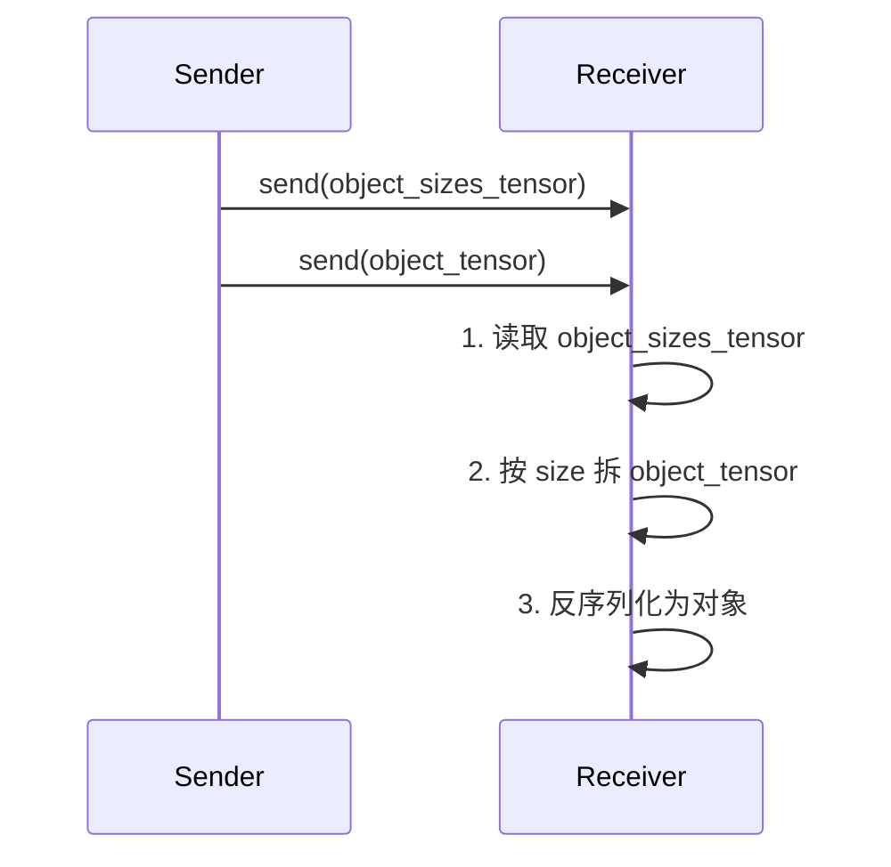
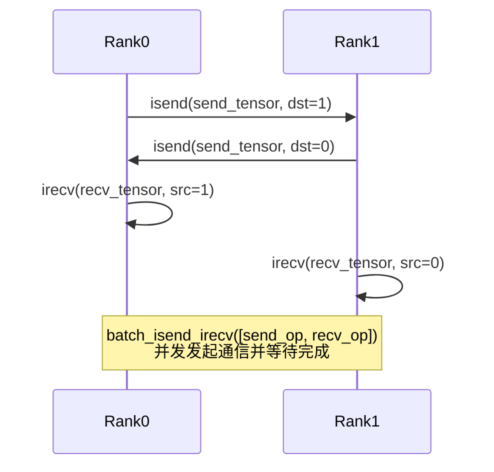

<!-- more -->


- [1. 基本概念与进程组](#1-基本概念与进程组)
- [2. 基本张量通信](#2-基本张量通信)
- [3. 对象列表通信](#3-对象列表通信)
- [4. 易错点与常见问题](#4-易错点与常见问题)
- [5. 批量点对点通信接口](#5-批量点对点通信接口)
- [6. 总结补充](#6-总结补充)
- [7. 参考资料](#7-参考资料)

---

## 1. 基本概念与进程组

* **group**（通信组）：分布式通信时的「子集」，允许只在一部分 rank 之间通信。
* **global rank**：全局进程编号（进程启动时分配的编号）。
* **group rank**：组内进程编号，组内第几个进程（与 global rank 无必然对应关系）。
* **src/dst**：通信目标（源/目的）rank，**注意：如果指定 group，这里是组内编号，不是全局编号**。

### 进程组举例

假如 group = `[2, 4, 6, 8, 10]`：

| group\_rank | global\_rank |
| :---------: | :----------: |
|      0      |       2      |
|      1      |       4      |
|      2      |       6      |
|      3      |       8      |
|      4      |      10      |

---

## 2. 基本张量通信

### 2.1 send / recv / isend / irecv

#### 参数说明

* `send(tensor, dst, group=None, tag=0)`
  发送 tensor 到组内 rank=dst 的进程。
* `recv(tensor, src, group=None, tag=0)`
  从组内 rank=src 的进程接收 tensor。
* `isend/irecv`
  异步版本，返回 Work 句柄，需要 `work.wait()`。

#### tag

* `tag` 是**消息编号/标签**，用于区分多条并发消息，只有 tag 一致才能正确配对。

#### group\_dst/group\_src

* 一般不用手动传，框架会根据 dst/src 和 group 自动推算。

---

### 2.2 通信流程示意图

#### 以 group = `[2, 4, 6, 8, 10]`，让 rank=2 发，rank=10 收为例：

```mermaid
graph TD
    subgraph group [group: [2, 4, 6, 8, 10]]
        A["global_rank=2<br>group_rank=0"]
        B["global_rank=10<br>group_rank=4"]
    end
    A -- send(tensor, dst=4, group=group) --> B
    B -- recv(tensor, src=0, group=group) --> A
```

* 发送端（global\_rank=2，group\_rank=0）：`send(tensor, dst=4, group=group)`
* 接收端（global\_rank=10，group\_rank=4）：`recv(tensor, src=0, group=group)`

---

### 2.3 代码实例

```python
# 发送端（global_rank=2）
group = dist.new_group([2, 4, 6, 8, 10])
tensor = torch.tensor([123])
dist.send(tensor, dst=4, group=group)   # dst=4 是 group 内 rank=4 → global_rank=10

# 接收端（global_rank=10）
group = dist.new_group([2, 4, 6, 8, 10])
tensor = torch.zeros(1, dtype=torch.int)
dist.recv(tensor, src=0, group=group)   # src=0 是 group 内 rank=0 → global_rank=2
print(tensor)
```

> ⚠️ **只要用了 group，src/dst 都是组内 rank，不是 global rank！**

---

### 2.4 异步通信（isend/irecv）

```python
work = dist.isend(tensor, dst=4, group=group)
work.wait()  # 等待发送完成
```

异步 recv 同理。

---

## 3. 对象列表通信

### 3.1 send\_object\_list / recv\_object\_list 用法

* 用于发送/接收包含任意 Python 对象的 list，底层通过序列化实现。
* 发送过程拆为两步：先发每个对象序列化后的 size，再发所有内容拼接后的 tensor。

---

### 3.2 对象通信流程图



---

### 3.3 典型代码示例

#### 发送端

```python
object_list = ["hello", 123, [1, 2, 3]]
dist.send_object_list(object_list, dst=4, group=group)
```

#### 接收端

```python
recv_list = [None, None, None]
dist.recv_object_list(recv_list, src=0, group=group)
print(recv_list)  # ['hello', 123, [1, 2, 3]]
```

---

### 3.4 接口实现核心代码

```python
# 接收端分割反序列化
offset = 0
for i, obj_size in enumerate(object_sizes_tensor):
    obj_view = object_tensor[offset : offset + obj_size]
    object_list[i] = _tensor_to_object(obj_view, obj_size, group)
    offset += obj_size
```

* `object_sizes_tensor` 记录每个对象的序列化长度
* `object_tensor` 是所有内容拼起来的一维 tensor
* 按顺序切片和反序列化，填回 object\_list

---

### 3.5 关于 rank\_objects

* `rank_objects` 是 `recv` 的返回值，表示消息来自哪个 rank（一般等于 src）
* 在多对多通信或 src=ANY\_SOURCE 时用来确认消息来源，和实际对象内容还原无关

---

## 4. 易错点与常见问题

* 只要用了 group，src/dst 都是**组内 rank**，不是 global rank。
* tag 用于区分多条消息，必须 send 和 recv 一致。
* send\_object\_list/recv\_object\_list 必须 object\_list 长度、顺序一致。
* group\_src/group\_dst 正常业务不需要自己传。

### 4.1. group、src/dst、group\_src/group\_dst 参数关系

* **group** 决定通信子集，src/dst 决定收发目标编号。
* 如果指定 group，则 src/dst 为**组内 rank**，不是 global rank。
* group\_src/group\_dst 一般不用手动传，框架自动推算。
* 映射关系：

  * 全局转组内：`group_ranks.index(global_rank)`
  * 组内转全局：`group_ranks[group_rank]`

---

## 5. 批量点对点通信接口

### 5.1 接口简介

`torch.distributed.batch_isend_irecv` 支持**同时发起多组异步点对点通信操作**（isend/irecv），显著提高大批量数据分发/收集的效率。
底层支持 NCCL、Gloo、UCC 等分布式后端，常用于分布式深度学习的 pipeline/通信 pattern 优化。

#### 函数签名

```python
torch.distributed.batch_isend_irecv(p2p_op_list: list[P2POp]) -> list[Work]
```

* **p2p\_op\_list**：一组 `torch.distributed.P2POp` 实例，每个实例描述一次 isend/irecv。
* 返回：所有操作的 request 句柄（Work 对象）列表，可通过 `.wait()` 同步。

---

### 5.2 典型使用场景

* **大批量点对点通信**，例如 pipeline 并行、环形 allreduce 手写优化等场景。
* 支持 isend/irecv 混合，能批量提升吞吐量。

---

### 5.3 调用流程与参数说明

#### P2POp 用法

每个 P2POp 定义一次通信操作，如下：

```python
P2POp(op, tensor, peer, group=None, tag=0)
```

* **op**：操作类型（`dist.isend` 或 `dist.irecv`）
* **tensor**：要发送/接收的 tensor
* **peer**：目标 peer 的编号（组内 rank）
* **group**（可选）：通信组（默认为 world）
* **tag**（可选）：消息编号/标签

---

### 5.4 代码实例

假设 world\_size=2，rank 0 和 rank 1 做一个环形通信：

```python
import torch
import torch.distributed as dist

rank = dist.get_rank()
world_size = dist.get_world_size()

send_tensor = torch.arange(2, dtype=torch.float32) + 2 * rank
recv_tensor = torch.zeros(2, dtype=torch.float32)

send_op = dist.P2POp(dist.isend, send_tensor, (rank + 1) % world_size)
recv_op = dist.P2POp(dist.irecv, recv_tensor, (rank - 1 + world_size) % world_size)

reqs = dist.batch_isend_irecv([send_op, recv_op])
for req in reqs:
    req.wait()

print(f"Rank {rank} 收到: {recv_tensor}")
```

**运行结果：**

```
Rank 0 收到: tensor([2., 3.])
Rank 1 收到: tensor([0., 1.])
```

---

### 5.5 通信流程图



---

### 5.6 重要注意事项

> **注意**
>
> * 如果使用 NCCL 后端，必须提前用 `torch.cuda.set_device` 设置好当前 GPU！
> * 如果这是某个 group 的**第一次通信**，group 里的所有 rank 必须都调用 `batch_isend_irecv`，否则行为未定义。
> * 以后只要不是第一次 collective，允许只用部分 rank 参与。

---

### 5.7 源码实现要点

* 自动判断通信后端是否支持**操作合并**（coalescing），如 NCCL 会在同一个上下文下批量启动，提升性能。
* 返回所有 request（Work）对象，用户可 `wait()`。

---

### 5.8 API 文档链接

* [PyTorch 官方 batch\_isend\_irecv 文档](https://pytorch.org/docs/stable/distributed.html#torch.distributed.batch_isend_irecv)
* [P2POp 官方说明](https://pytorch.org/docs/stable/distributed.html#torch.distributed.P2POp)

---

## 6. 总结补充

* 张量点对点通信：`send/recv/isend/irecv/batch_isend_irecv`
* 对象通信：`send_object_list/recv_object_list`
* 批量点对点通信能极大提升 pipeline 通信效率
* 统一返回 Work 句柄，支持同步或异步
* group/src/dst 使用方式同上文描述

---


## 7. 参考资料

* [PyTorch Distributed 官方文档](https://pytorch.org/docs/stable/distributed.html)
* [PyTorch distributed\_c10d.py 源码](https://github.com/pytorch/pytorch/blob/main/torch/distributed/distributed_c10d.py)
* [Mermaid Live Editor](https://mermaid-js.github.io/mermaid-live-editor/)

---

