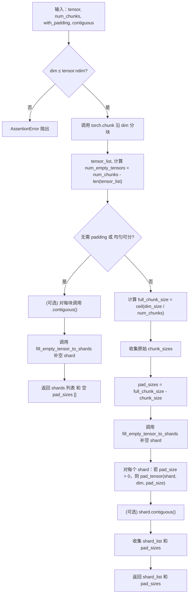

---
title: pytorch Shard
categories:
  - 分布式基础
tags:
  - shard
description: pytorch中Shard实现
---

<!-- more -->

---

## 1. _split_tensor分析

### 1.1 代码实现流程图（Mermaid）



---

### 1.2 关键点详解

#### 🧠 为什么要 Padding？

用于保证在分布式环境中（比如 `scatter`、`all_gather` 等 collective 操作）每个 rank 的 shard 大小一致，避免因为尺寸不对齐导致通信失败。只有 `tensor.size(dim) % num_chunks ≠ 0` 且 `with_padding=True` 时，才会进行 padding。

#### 🧩 `fill_empty_tensor_to_shards`

`torch.chunk` 在尺寸较小或 `num_chunks` 更大时不会输出空 tensor。该函数用于补全：在 `tensor_list` 少于 `num_chunks` 时，补充形状合法但 dim 上为 0 的空 tensor，使 shard 数目一致，便于后续统一处理。

#### 🧼 `pad_tensor`

若当前 shard 小于 `full_chunk_size`，则在指定维度末尾补零，确保所有 shard 的形状一致。

#### 🧱 `contiguous`

为提升内存连贯性和通信效率，可调用 `.contiguous()` 重排内存布局。

---

### 1.3 实际调用示例（需 Padding）

以下为无法均匀分片，因 `num_chunks=4` 而触发 pad 的场景：

```python
import torch
from torch.distributed.tensor.placement_types import Shard

# 构造张量
tensor = torch.arange(1, 13).reshape(2, 6)  # shape [2, 6]

# 在 dim=1 上拆为 4 份，不整除将触发 padding
sharder = Shard(dim=1)
shards, pad_sizes = sharder._split_tensor(tensor, num_chunks=4, with_padding=True)

print("Pad sizes:", pad_sizes)
for i, (sh, pad) in enumerate(zip(shards, pad_sizes)):
    print(f"Shard {i} shape: {tuple(sh.shape)}, pad: {pad}")
    print(sh)
```

#### ✅ 预期结果

* `tensor.size(1)=6`, `num_chunks=4` ⇒ `full_chunk_size = ceil(6/4) = 2`
* `torch.chunk` 会出 4 块，但最后一两块可能为 empty
* pad\_sizes 可能为 `[0, 0, 0, 2]`
* 最终每块大小都是 `[2]` (dim=1)，padding 补齐

```
Pad sizes: [0, 0, 0, 2]
Shard 0 shape: (2, 2), pad: 0
tensor([[1, 2],
        [7, 8]])
Shard 1 shape: (2, 2), pad: 0
tensor([[ 3,  4],
        [ 9, 10]])
Shard 2 shape: (2, 2), pad: 0
tensor([[ 5,  6],
        [11, 12]])
Shard 3 shape: (2, 2), pad: 2
tensor([[0, 0],
        [0, 0]])
```

---

### 1.4 总结

* `_split_tensor` 的作用是**将一个 Tensor 沿指定维度切分为固定份数**，并在 **不能整除时自动补齐**。
* 它保障了各 shard 在通信阶段尺寸一致，**适用于分布式张量并行场景**。
* 实际代码通过 `torch.chunk`、`fill_empty_tensor_to_shards`、`pad_tensor` 等手段，轻松实现这一目标。

---


