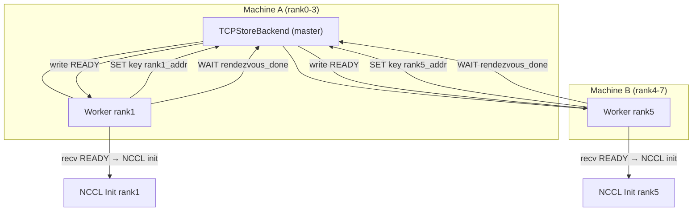

---
title: pytorch中TCPStore Rendezvous机制
categories:
  - 分布式基础
tags:
  - tcpstore
description: pytorch中TCPStore Rendezvous实现机制记录
---

<!-- more -->

---

## 🧠 背景概述

- **目标**：在 `init_process_group` 中实现跨进程注册、排序及 barrier 同步，为 NCCL/Gloo 通信组构建创建一致上下文。
- **时序**：所有 `set`/`get`/`wait` 操作均发生在 NCCL 通信初始化之前（即 rendezvous 阶段）。
- **机制**：socket 客户端—服务器模型 + backend 控制同步逻辑。

---

## 1. 消息协议格式

客户端向 master 发送的包格式为：

```

\[4 B 总长度]\[1 B 操作码]\[4 B key\_len]\[4 B value\_len]\[key]\[value]

```

- 总长度：网络字节序，不含自身；
- 操作码：`1=SET`, `2=GET`, `3=WAIT`；
- `key_len`, `value_len`：后续字段长度；
- `key`, `value`：实际数据；
- Master 解析后，回复：`OK` / value 内容 / `READY` 等。

---

## 2. Rendezvous 阶段流程（2 机，4 卡 each，聚焦 rank1 & rank5）



### 🧩 步骤解析

1. **Master** 在端口（如 29500）侦听，接收连接；
2. **rank1 / rank5** 分别发送 `SET`（注册地址）；
3. 随后发送 `WAIT("rendezvous_done")`，Socket 处于阻塞状态；
4. Master 收集所有 8 个 rank 的 `SET` 后，遍历 `wait` 阻塞的连接，逐一写入 `READY`；
5. Worker 收到 `READY`，退出阻塞，进入 NCCL 初始化阶段；
6. 随后在这一阶段内：交换 `ncclUniqueId` (via store), 调用 `ncclCommInitRank` 构建通信组 ([github.com][1], [pytorch.org][2])。

---

## 3. Backend 细节对比

| Backend                | I/O 模型                               | 特点与适应性                                    |
| ---------------------- | ------------------------------------ | ----------------------------------------- |
| **经典 TCPStoreBackend** | `accept()` + per-conn 阻塞/POLL        | 简单，连接较多时扩展性差                              |
| **libuv 异步 Backend**   | 单线程 event-loop, `readable/writeable` | 默认启用（v2.4+），高并发更优 ([docs.pytorch.org][3]) |

* libuv backend 使用 `uv_read_start` 自动分块读取，根据 header 控制拼包；
* 注册 `WAIT` 时，将 conn 保存在 map 中，不立即回写；当条件满足，触发 `uv_write()` → `uv_write_cb` 实现唤醒。

---

## 4. partial-key WAIT 机制

* 客户端可以执行 `store.wait(["kA", "kB"])`；
* Master 将此等待登记至 `MultiWaitRegistry`；
* 当 **所有相关 key 均被 `SET`** 后，才统一向该连接写 `READY`，触发唤醒。

---

## 5. “广播 READY” 的实现机制

* 不是通过 NCCL/Gloo broadcast 算子；
* Master **遍历挂起的 WAIT sockets，逐个写 READY**；
* 为 rendezvous 过程自身提供同步机制，通信组尚未创建。

---

## 6. 时间线概览

```text
┌──────────────────────────┐
│ SET/WAIT via TCP Store   │  # rendezvous 阶段
└──────────────────────────┘
            ↓
┌──────────────────────────┐
│ recv READY → wait returns│
└──────────────────────────┘
            ↓
┌──────────────────────────┐
│ NCCL Init                │  # 调用 ncclUniqueId, CommInitRank
└──────────────────────────┘
            ↓
┌──────────────────────────┐
│ Collective Ops (DDP)     │
└──────────────────────────┘
```

---

## ✅ 总结要点

1. 标注 **rank1 / rank5 的流程图**，更直观；
2. `SET` + `WAIT` 操作全部发生于 rendezvous 阶段，见图；
3. Master “广播 READY” 是 socket 写操作，不是通信库广播；
4. NCCL 初始化在 rendezvous 完成后进行；
5. libuv backend 提供更高效 I/O 处理及 message 拼接处理能力 ([docs.pytorch.org][3], [pytorch.org][4], [github.com][5])。

---

[1]: https://github.com/pytorch/pytorch/issues/107177?utm_source=chatgpt.com "Timeout during NCCL initialization due to store #107177 - GitHub"
[2]: https://pytorch.org/docs/stable/elastic/rendezvous.html?utm_source=chatgpt.com "Rendezvous — PyTorch 2.7 documentation"
[3]: https://docs.pytorch.org/tutorials/intermediate/TCPStore_libuv_backend.html?utm_source=chatgpt.com "Introduction to Libuv TCPStore Backend - PyTorch documentation"
[4]: https://pytorch.org/docs/stable/distributed.html?utm_source=chatgpt.com "Distributed communication package - torch.distributed"
[5]: https://github.com/pytorch/pytorch/blob/main/torch/distributed/rendezvous.py?utm_source=chatgpt.com "pytorch/torch/distributed/rendezvous.py at main - GitHub"

