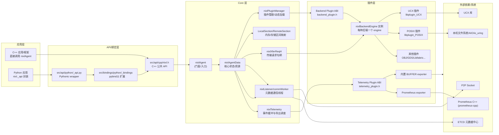
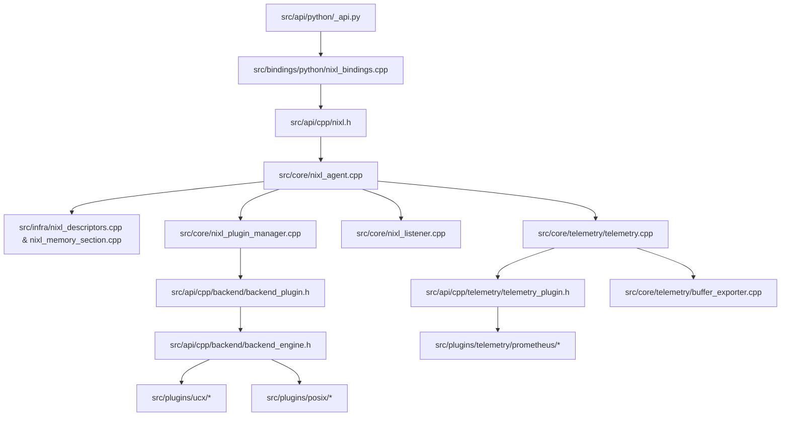
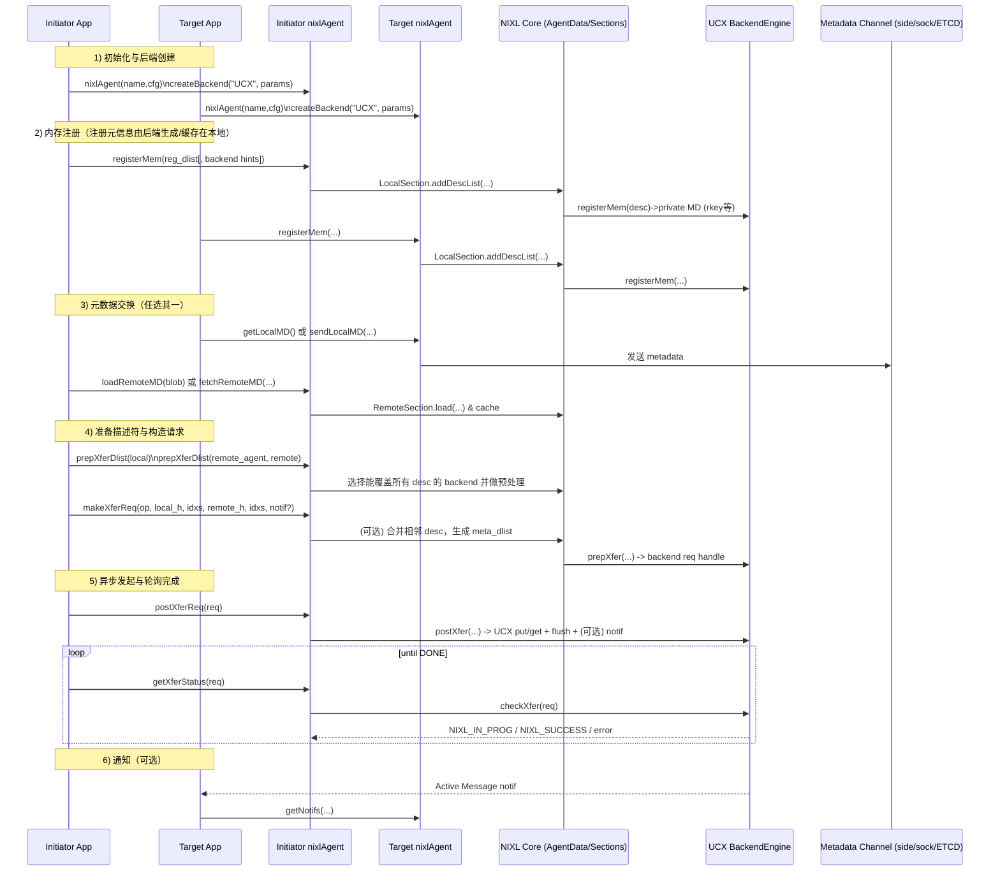
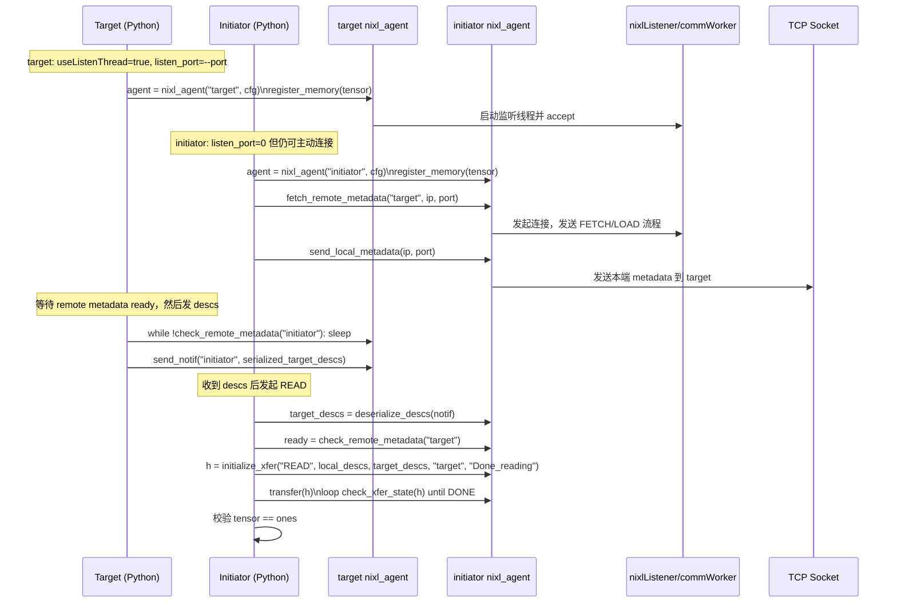
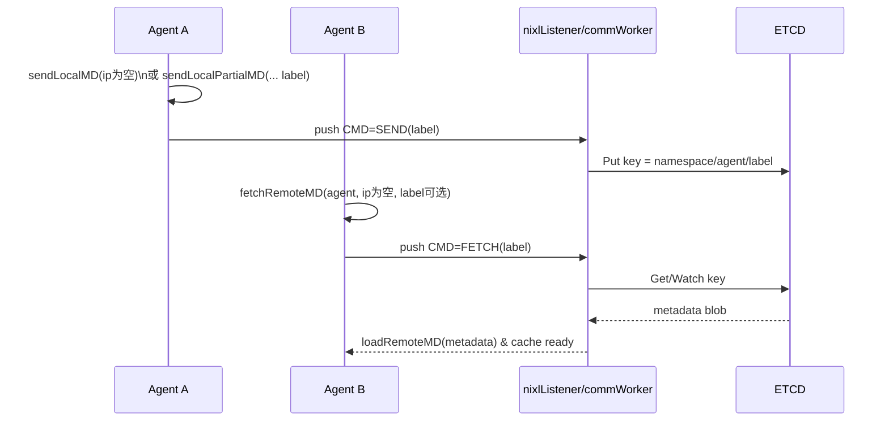
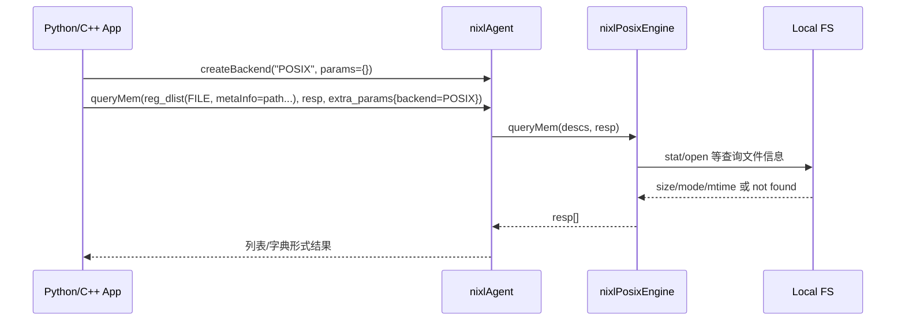

<!-- more -->

---

# nixl 解读

## 执行摘要

仓库 **nixl** 是一个以插件化方式抽象“内存/存储 + 传输后端”的高性能数据搬运库，核心对象是 `nixlAgent`：应用通过它完成 **插件发现/后端实例化、内存/存储注册、元数据交换、传输请求构造与异步执行、通知收发** 等完整流程。其关键设计点是把“**如何搬运**”交给后端插件（如 `UCX`、`POSIX`），把“**如何选用后端、如何组织描述符、如何管理元数据与生命周期**”留在核心层。

仓库 README 明确表述该工程为 **NIXL（NVIDIA Inference Xfer Library）**，并指向更大生态（上游为 `ai-dynamo/nixl`）。 结合上游官方说明，NIXL 面向 AI 推理框架的点对点通信（如在异构内存/存储之间搬运 KV cache），并通过模块化插件抽象 CPU/GPU/文件/对象存储等。

从源码证据看，本仓库的“主干骨架”可概括为：

- **API 层**：C++ 头文件 `src/api/cpp/nixl.h` 定义公共 API；Python 通过 `pybind11` 模块 `_bindings` 暴露同名/同义能力，再由 `src/api/python/_api.py` 提供更“Pythonic”的封装与类型转换（`torch.Tensor`、`numpy`）。  
- **Core 层**：`src/core/nixl_agent.cpp`、`src/core/agent_data.h` 负责后端选择、元数据缓存、请求句柄、并发控制、通知聚合等；`src/core/nixl_listener.cpp` 提供 socket/ETCD 式元数据互通的通信线程。  
- **Infra 层**：描述符列表与内存区间映射（注册内存→可覆盖范围）等“通用数据结构/算法”在 `src/infra/nixl_descriptors.cpp`、`src/infra/nixl_memory_section.cpp`。  
- **插件体系**：后端插件遵循 `backend_engine.h / backend_plugin.h` 的 SB API（service backend API）与动态加载规范；例如 `UCX` 插件（RDMA/AM/RMA）实现了连接、注册、传输、通知等全套能力，并支持进度线程/线程池优化；`POSIX` 插件面向本机文件 I/O，支持多种异步 I/O 队列实现并提供 `queryMem`。  
- **遥测（Telemetry）**：核心 `nixlTelemetry` 负责事件缓冲与周期导出，导出端以“遥测插件”形式加载（如内置 BUFFER、可选 Prometheus exporter），配置主要由环境变量控制。  

本报告将围绕你要求的：总体架构、模块结构、调用流、接口清单、配置与数据模型、关键算法、依赖图、运行时行为、测试/示例、扩展点、性能/安全评估与改进建议，给出逐项可追溯（含文件路径证据）的分析。若仓库未明确某细节，将标注“未在仓库中指定”。

## 总体架构与运行时模型

### 分层架构与数据流

下面是以“应用视角→核心→插件→外部系统”为主线的架构图（Mermaid Flowchart）。图中组件名称与职责均能在对应文件中找到实现或接口定义。



要点：  
- `nixlAgent` 的公共 API（插件发现、后端创建、注册/解注册、prep/make/post/check、通知、元数据通道等）完整定义在 `src/api/cpp/nixl.h`。  
- Python `_bindings` 明确将 `nixlAgent`、`nixlAgentConfig`、`nixlXferDList/nixlRegDList`、状态枚举、异常映射等导出成 Python 类型。  
- 后端插件 ABI 是 `backend/backend_plugin.h`（动态加载 `nixl_plugin_init/fini`，创建 `nixlBackendEngine`）。  
- 遥测插件 ABI 是 `src/api/cpp/telemetry/telemetry_plugin.h`（动态加载 `nixl_telemetry_plugin_init/fini`，创建 exporter）。  

### 运行时线程与并发模型

NIXL 的并发主要来自三类来源（是否启用由 `nixlAgentConfig` 与后端自身能力共同决定）：

1) **后端进度线程（progress thread）**  
`nixlAgentConfig::useProgThread`、`pthrDelay` 用于启用/调节后端进度线程（尤其在 UCX 后端中体现明显：`nixlUcxThreadEngine`、`nixlUcxSharedThread` 轮询 worker/efd，并在需要时周期性唤醒）。  

2) **监听/通信线程（listener thread / comm worker）**  
`nixlAgentConfig::useListenThread`、`listenPort`、`lthrDelay` 控制是否启动监听线程，用于 socket/ETCD 的元数据发送、拉取、失效通知等（`nixl_listener.cpp` 中的 `commWorker` 处理 accept、命令队列、网络收发与 ETCD watch）。  

3) **核心层的锁策略（thread sync mode）**  
`nixl_thread_sync_t` 提供 `NONE / STRICT / RW` 等模式，`nixlLock` 会把锁操作变成 no-op 或 `absl::Mutex` 的写锁/读写锁。`nixlAgent` 会据此决定是否串行化对后端与核心共享状态的访问。  

仓库未明确给出“全局线程安全保证等级”的一句话规格，但从设计上可推断：**STRICT 模式倾向于在 agent 层串行化后端访问；RW 模式允许并行读并要求后端/内部结构具备更强自洽性。** 该意图在 `sync.h` 及 UCX 后端关于多线程支持的注释中都能找到佐证。  

## 模块结构与依赖关系

### 目录与模块清单

下表按“模块/目录→职责→关键文件→对外产物”整理（文件路径为仓库内真实路径）。

| 模块/目录 | 职责 | 关键文件（示例） | 主要产物/接口 |
|---|---|---|---|
| `src/api/cpp/` | C++ 公共 API、类型、参数、描述符、遥测插件接口等 | `nixl.h`, `nixl_params.h`, `nixl_descriptors.h`, `telemetry/telemetry_plugin.h` | 头文件 API；供 C++ 与 pybind 复用 |
| `src/api/python/` | Python 顶层封装：类型适配、资源句柄管理、用户友好 API | `_api.py` | `nixl_agent`、`nixl_agent_config` 等 |
| `src/bindings/python/` | pybind11 绑定（把 C++ API 暴露给 Python） | `nixl_bindings.cpp`, `meson.build` | `_bindings` 扩展模块 |
| `src/core/` | Agent 核心实现、插件管理、监听线程、遥测调度、同步机制 | `nixl_agent.cpp`, `agent_data.h`, `nixl_listener.cpp`, `telemetry/*.cpp` | `libnixl` 的主体逻辑 |
| `src/infra/` | 通用数据结构：描述符列表、内存段映射、序列化等 | `nixl_descriptors.cpp`, `nixl_memory_section.cpp`, `mem_section.h` | 支撑核心与后端的数据结构 |
| `src/plugins/` | 后端插件实现（UCX/POSIX/…）与遥测 exporter 插件（Prometheus 等） | `ucx/*`, `posix/*`, `telemetry/prometheus/*` | `libplugin_*` 动态库；telemetry exporter 动态库 |
| `test/` | 测试与示例程序（部分按依赖条件启用） | `test/meson.build`, `test/nixl/*`, `test/unit/*` | `nixl_test`, `agent_example` 等 |
| `examples/python/` | Python 示例（两端通信、queryMem 等） | `basic_two_peers.py`, `query_mem_example.py` | 可运行脚本 |

对应的构建系统采用 **Meson**，并通过 `meson_options.txt` 提供插件与依赖路径、是否构建测试/示例、是否构建 Rust bindings 等开关。

### 模块依赖表（面向“代码调用/链接”）

这张表聚焦“谁依赖谁”（自上而下），便于理解调用边界与扩展点。

| 上层模块 | 直接依赖（内部） | 直接依赖（外部） | 说明 |
|---|---|---|---|
| Python 应用（`nixl._api`） | `_bindings`（pybind）、`nixl_bindings` 暴露类型 | `torch`, `numpy` | `_api.py` 做 tensor/ndarray→descriptor list 的转换，并封装句柄释放语义（`__del__`/`release()`）。 |
| `_bindings`（pybind11） | `nixl.h`、`serdes` | `pybind11` | 将 `nixlAgent`、描述符 list、状态枚举映射到 Python，并把 `nixl_status_t` 映射成 Python 异常。 |
| Core（`nixl_agent.cpp` 等） | infra（descriptors、memory_section）、plugin_manager、listener、telemetry | `absl`、`asio`（部分）、ETCD 客户端（可选） | 负责后端选择与请求生命周期、元数据缓存/发送/拉取、通知聚合、遥测上报。 |
| Plugin Manager | backend/telemetry plugin ABI、配置工具 | `dlopen`/`filesystem` | 通过环境变量/默认路径加载插件，得到“可用插件列表”。 |
| 后端插件（UCX） | backend_engine ABI、serdes、core types | `UCX`、`asio`、可能的 `CUDA` | UCX engine 提供远程连接、注册、RMA、通知、进度线程/线程池。 |
| 后端插件（POSIX） | backend_engine ABI、file_utils、sync | `liburing`/`libaio`/`rt`（按平台） | 本机文件 IO 插件；同时实现 `queryMem` 查询文件信息。 |
| 遥测 exporter 插件（Prometheus） | telemetry_plugin ABI、telemetry_exporter ABI | `prometheus-cpp`（CMake subproject） | 以共享库形式被 `nixlTelemetry` 按名称加载。 |

### 模块依赖图（Mermaid）



（上述每段依赖都可在对应 include/构建文件中找到直接证据，例如 `_bindings` 直接 include `nixl.h`，UCX 插件 `ucx_plugin.cpp` 基于 `backend_plugin.h` 创建 plugin 实例等）。

## 关键调用链与主要用例时序

本节按“你真正会怎么用”的角度，给出核心用例的调用序列与关键内部动作。为了可读性，时序图以 **initiator（发起端）** / **target（目标端）** / **NIXL Core** / **Backend** / **通信通道** 五类参与者表示。

### 用例一：两端 RDMA/网络搬运（以 UCX 后端 + 通知为例）

该用例对应最典型的 remote-to-remote（或 remote-to-local）搬运：两端先注册内存、交换元数据（可通过 side-channel 或 socket/ETCD），然后发起端构造传输请求并异步执行。公共 API 的参与函数集中在 `nixlAgent`：`registerMem`、`getLocalMD/loadRemoteMD` 或 `sendLocalMD/fetchRemoteMD`、`prepXferDlist`、`makeXferReq/createXferReq`、`postXferReq/getXferStatus`、`getNotifs/genNotif`。



关键内部证据：  
- UCX 后端在 `postXfer` 中对每个 EP 批量发起 read/write，并对每条连接做 flush；若 `opt_args` 携带通知，可能立即发送或延迟到 `checkXfer` 中补发。  
- UCX 的通知使用 Active Message（`ucp_am_send_nbx`），回调里将 `name/msg` 解包后追加到通知列表。  

### 用例二：P2P socket 元数据互通（对应 `basic_two_peers.py`）

`examples/python/basic_two_peers.py` 展示了一个“target 开监听端口、initiator 主动 fetch/发送元数据”的流程；脚本同时演示了：  
- 两端都启用 listen thread（target 监听指定端口，initiator 端口为 0 表示不监听）；  
- initiator 调用 `fetch_remote_metadata` 与 `send_local_metadata`；  
- 描述符列表（按 tensor 行拆分）通过 `send_notif` 以 bytes 形式发送给 initiator；  
- initiator 通过 `initialize_xfer("READ", ...)` 发起读取并校验最终 tensor 内容，结束打印 “Test Complete.”。



内部实现侧，socket 通道由 `nixl_listener.cpp` 驱动：  
- `commWorker` 循环处理中控命令队列（SEND/FETCH/INVL 等）与 socket 收发；  
- 连接使用非阻塞 socket + `poll`，以长度前缀方式收发 payload；  
- 对 listener 线程的节流由 `lthrDelay`（微秒）控制。  

### 用例三：ETCD 元数据中心（概念时序）

仓库核心代码已经包含 ETCD watch/命令处理框架，并在 `nixlAgentConfig` 中提供 `etcdWatchTimeout`。 上游官方说明给出运行所需环境变量（`NIXL_ETCD_ENDPOINTS`、`NIXL_ETCD_NAMESPACE`）与示例执行方式。



### 用例四：本机文件 I/O（POSIX 后端）与 `queryMem`

POSIX 插件的特性非常“明确”：  
- `supportsRemote()` 返回 false，意味着它不负责跨机器远程协议；  
- `getSupportedMems()` 为 `{FILE_SEG, DRAM_SEG}`；  
- `prepXfer` 参数强校验：`remote_agent` 必须等于本地 `localAgent`，本质是“loopback 文件读写”；并要求 local 为 DRAM、remote 为 FILE、两边描述符数量一致。  

`queryMem` 在 POSIX 中被实现为“把 desc 的 `metaInfo` 当成文件名列表，批量查询文件属性”。 Python 示例 `query_mem_example.py` 正是构造 `(0,0,0,<filepath>)` 形式的描述符（把路径放在 metaInfo），然后调用 `query_memory(... mem_type="FILE")` 并打印 size/mode/mtime。



## 公共 API 与接口清单

本节把你关心的“对外接口 + 内部接口”按层次列出，并给出签名、参数语义、返回值与最小示例。所有 C++ 公共 API 均来自 `src/api/cpp/nixl.h`。

### C++：`nixlAgent` 公共 API（核心门面）

#### 初始化与后端/插件管理

| API | 签名（简化呈现） | 返回 | 说明 |
|---|---|---|---|
| 构造/析构 | `nixlAgent(const std::string& name, const nixlAgentConfig& cfg)` / `~nixlAgent()` | — | 创建 agent，内部持有 `nixlAgentData`。 |
| 插件发现 | `nixl_status_t getAvailPlugins(std::vector<nixl_backend_t>& plugins)` | `nixl_status_t` | 扫描插件路径，返回可用插件名列表。 |
| 获取插件默认参数 | `getPluginParams(type, mems, params)` | `nixl_status_t` | 返回插件支持的内存类型与初始化参数默认值。 |
| 获取后端实例参数 | `getBackendParams(backend, mems, params)` | `nixl_status_t` | 后端实例化后，参数可能“补全”为实际生效值。 |
| 创建后端 | `createBackend(type, params, backend_out)` | `nixl_status_t` | 实例化某插件的 engine，得到 `nixlBackendH*`。 |

最小示例（C++，概念性）：

```cpp
#include "nixl.h"

nixlAgentConfig cfg;
/* cfg.useListenThread = true; cfg.listenPort = 5555; ... */

nixlAgent agent("initiator", cfg);

// 发现插件
std::vector<nixl_backend_t> plugins;
agent.getAvailPlugins(plugins);

// 创建 UCX 后端
nixl_b_params_t params; // 可从 getPluginParams 获取默认，再覆盖
nixlBackendH* ucx = nullptr;
agent.createBackend("UCX", params, ucx);
```

（公共接口与字段定义均在 `src/api/cpp/nixl.h` 与 `src/api/cpp/nixl_params.h`）。

#### 内存/存储注册与查询

| API | 签名（简化） | 返回 | 重点 |
|---|---|---|---|
| 注册 | `registerMem(const nixl_reg_dlist_t& descs, const nixl_opt_args_t* extra=nullptr)` | `nixl_status_t` | 可通过 `extra->backends` 限制只向某些后端注册。 |
| 解注册 | `deregisterMem(descs, extra)` | `nixl_status_t` | desc 必须能匹配已注册项。 |
| 查询 | `queryMem(descs, resp, extra)` | `nixl_status_t` | **必须在 `extra` 里指定 backend**（接口注释已写明）。 |

Python 示例对 `queryMem` 的实际可用方式（metaInfo=filepath）见：

#### 传输准备、请求构造、异步执行、遥测

| 阶段 | API | 典型作用 |
|---|---|---|
| 准备描述符 | `prepXferDlist(agent_name, descs, dlist_hndl_out, extra)` / `prepXferDlist(descs, dlist_hndl_out, extra)` | 预处理描述符，确保至少存在一个后端能“覆盖所有条目”；成功后得到 `nixlDlistH*`。 |
| 构造请求 | `makeXferReq(op, local_side, lidx, remote_side, ridx, req_out, extra)` | 从“已准备的 dlist handle”挑选索引生成 `nixlXferReqH*`。 |
| 一步式构造 | `createXferReq(op, local_descs, remote_descs, remote_agent, req_out, extra)` | 内部会做 prep + make；若有重复 desc，性能可能比手动 prep 差。 |
| 代价估计 | `estimateXferCost(req, duration, err_margin, method, extra)` | 由后端提供分析/经验估计；UCX 直接调用 `ucp_ep_evaluate_perf`。 |
| 异步启动 | `postXferReq(req, extra)` | 返回 `NIXL_SUCCESS` 或 `NIXL_IN_PROG`。 |
| 轮询状态 | `getXferStatus(req)` | 直到完成或失败。 |
| 获取遥测 | `getXferTelemetry(req, telemetry_out)` | 返回 start/post/xfer 时间与字节数/desc 数等。 |
| 请求清理 | `releaseXferReq(req)` / `releasedDlistH(dlist)` | 释放 request/descriptor handle。 |

#### 通知与元数据（3 类通道）

| 类别 | API | 说明 |
|---|---|---|
| 通知 | `getNotifs(map, extra)` / `genNotif(remote, msg, extra)` | 通知可用于控制消息或传输完成信号。 |
| Side-channel 元数据 | `getLocalMD(str_out)` / `getLocalPartialMD(descs,str_out,extra)` / `loadRemoteMD(blob, agent_name_out)` / `invalidateRemoteMD(remote)` | 元数据 blob 由应用自己传递给对端（如 RPC、共享存储等）。 |
| Socket/ETCD 元数据 | `sendLocalMD(extra)` / `sendLocalPartialMD(descs, extra)` / `fetchRemoteMD(name, extra)` / `invalidateLocalMD(extra)` / `checkRemoteMD(name, descs)` | 通过 listener/commWorker 与 socket 或 ETCD 交互。 |

### Python：`nixl_agent`（Pythonic 封装）

Python 侧分层非常明确：

- `_bindings`：严格绑定 C++ 类型、枚举、异常、底层调用；由 `nixl_bindings.cpp` 定义。  
- `_api.py`：提供 `nixl_agent_config` 与 `nixl_agent`，并提供 tensor/ndarray/list(tuple)→descriptor list 的适配、句柄对象（`nixl_xfer_handle`、`nixl_prepped_dlist_handle`）的释放语义。  

#### 关键类与方法（节选）

- `nixl_agent_config(enable_prog_thread=True, enable_listen_thread=False, listen_port=0, capture_telemetry=False, num_threads=0, backends=["UCX"])`：构造默认配置，并用于 agent 初始化时设置底层 `nixlAgentConfig` 字段（注意 `_api.py` 中固定写了 `pthrDelay=0`、`lthrDelay=100000`）。  
- `nixl_agent(agent_name, nixl_conf=None, instantiate_all=False)`：创建 agent；读取可用插件；按配置 `create_backend`。  
- `register_memory / deregister_memory / query_memory`：分别对应 C++ `registerMem / deregisterMem / queryMem`，并把 Python `backends: list[str]` 映射为 `nixlBackendH*` 列表。  
- `prep_xfer_dlist / make_prepped_xfer / initialize_xfer / transfer / check_xfer_state`：覆盖 prep/make/create/post/check 全流程。  

最小示例（Python，来自仓库示例风格）：

```python
from nixl._api import nixl_agent, nixl_agent_config
import torch

cfg = nixl_agent_config(enable_prog_thread=True, enable_listen_thread=True, listen_port=5555)
agent = nixl_agent("target", cfg)

tensor = torch.ones((10,16), dtype=torch.float32)
reg_descs = agent.register_memory(tensor)

# ... 等待元数据交换后 ...
# agent.initialize_xfer("READ", local_descs, remote_descs, "remote", notif_msg=b"done")
```

（示例的完整可运行版本见 `examples/python/basic_two_peers.py`）。

#### 异常与返回值语义

Python 绑定明确把 `nixl_status_t` 映射为异常类型（如 `NIXL_ERR_NOT_FOUND → nixlNotFoundError`），以简化 Python 侧控制流；`NIXL_IN_PROG`/`NIXL_SUCCESS` 不抛异常。

### 后端插件接口（Backend SB API）

后端插件需要实现两层接口：

1) **ABI/插件对象层**：`backend/backend_plugin.h`  
- 必须导出 `extern "C" nixlBackendPlugin* nixl_plugin_init()` 与 `nixl_plugin_fini()`（动态插件）；或提供静态创建函数（静态插件模式）。  
- `nixlBackendPluginCreator<EngineT>` 模板负责生成带有 `create_engine/destroy_engine` 回调的 plugin 实例，并携带插件名、版本、默认参数与支持的 mem types。  

2) **Engine（SB API）层**：`backend/backend_engine.h`  
典型虚函数族（按职责分组）包括：  
- 能力/支持：`supportsRemote()`、`supportsLocal()`、`supportsNotif()`、`getSupportedMems()`  
- 连接/连接信息：`getConnInfo()`、`loadRemoteConnInfo()`、`connect()`、`disconnect()`  
- 元数据：`registerMem/deregisterMem`、`getPublicData`、`loadLocalMD/loadRemoteMD/unloadMD`  
- 传输：`prepXfer/postXfer/checkXfer/releaseReqH`，以及可选的 `estimateXferCost`  
- 其他：`queryMem`、`prepMemView/releaseMemView`、通知 `getNotifs/genNotif`（若支持）  

UCX 插件对上述接口给出了“最完整范例”：支持 remote/local/notif，全链路具备连接、RMA、AM 通知、mem view、成本估计等实现。

### 遥测插件接口（Telemetry Exporter API）

遥测导出器同样是插件化：

- exporter 抽象基类：`src/api/cpp/telemetry/telemetry_exporter.h`  
  - `struct nixlTelemetryExporterInitParams { agentName; maxEventsBuffered; }`  
  - `class nixlTelemetryExporter { virtual nixl_status_t exportEvent(const nixlTelemetryEvent&)=0; }`  
  - exporter 名称环境变量：`NIXL_TELEMETRY_EXPORTER`（`telemetryExporterVar`）。  

- 插件 ABI：`src/api/cpp/telemetry/telemetry_plugin.h`  
  - 导出 `nixl_telemetry_plugin_init/fini`，返回 `nixlTelemetryPlugin`（含 `create_exporter` 函数指针）。  

Core 侧的 `nixlTelemetry` 在初始化时读取 exporter 名称：若未显式指定 exporter、但设置了 `NIXL_TELEMETRY_DIR`，则使用默认 exporter `"BUFFER"`；并按 `NIXL_TELEMETRY_BUFFER_SIZE`（默认 4096）与 `NIXL_TELEMETRY_RUN_INTERVAL`（默认 100ms）配置周期导出任务。  

## 配置、数据模型与关键算法

### 配置项与默认值

#### 构建期配置（Meson options）

`meson_options.txt` 给出了最关键的构建开关与默认值，包括 UCX/libfabric/ETCD 头库路径、启用/禁用某些后端、插件选择、日志级别、Rust bindings、以及是否构建测试/示例等：

- 路径类：`ucx_path=""`、`libfabric_path=""`、`etcd_inc_path=""`、`etcd_lib_path=""`、`gds_path="/usr/local/cuda/"`、`cudapath_*`  
- 插件构建：`static_plugins=""`、`enable_plugins=""`、`disable_plugins=""`  
- 功能开关：`disable_gds_backend=false`、`disable_mooncake_backend=false`、`build_docs=false`、`rust=false`  
- 测试与示例：`build_tests=true`、`build_examples=true`、`build_nixl_ep=false`、`test_all_plugins=false`  

#### 运行期配置：`nixlAgentConfig`（默认值）

`src/api/cpp/nixl_params.h` 明确列出默认值与字段含义：  

- `useProgThread=false`  
- `useListenThread=false`  
- `listenPort=0`  
- `syncMode=NIXL_THREAD_SYNC_DEFAULT`  
- `captureTelemetry=false`  
- `pthrDelay=0`（微秒）  
- `lthrDelay=100000`（微秒）  
- `etcdWatchTimeout=5,000,000us`  

Python `_api.py` 的默认构造趋向更“开箱可用”：`enable_prog_thread=True`، `enable_listen_thread=False`，但最终是否生效仍取决于具体后端/构建与平台能力。

#### 环境变量配置（运行时）

仓库内与遥测强相关的环境变量在代码中“硬编码为常量”：

- `NIXL_TELEMETRY_EXPORTER`：选择 exporter 插件名。  
- `NIXL_TELEMETRY_DIR`：BUFFER exporter 的共享内存/文件落地目录。  
- `NIXL_TELEMETRY_BUFFER_SIZE`（默认 4096），`NIXL_TELEMETRY_RUN_INTERVAL`（默认 100ms）。  
- 插件路径：插件管理器支持从环境变量指定插件目录（常见命名为 `NIXL_PLUGIN_DIR`，并在 Python 示例中打印该变量）。  
- ETCD 相关环境变量在上游官方文档中明确为 `NIXL_ETCD_ENDPOINTS`、`NIXL_ETCD_NAMESPACE`。  

（仓库还提供 `src/utils/common/configuration.h` 的通用环境变量读取与类型转换工具，可推测未来还会扩展为配置文件等形式，但当前注释写明“配置文件未来可能引入”。）

#### 后端插件参数：UCX 与 POSIX（示例级“可落地”）

- UCX 默认参数通过 `get_ucx_backend_common_options()` 暴露，包含：  
  - `ucx_devices`（默认空字符串）  
  - `num_workers`（默认 `"1"`）  
  - `ucx_error_handling_mode`（默认 `"peer"`）  

- UCX 运行时还会读取更多 custom params：  
  - `num_threads`（>0 则启用 threadpool engine）  
  - `split_batch_size`（用于大 batch 分片并行）  
  - `ucx_num_device_channels`、`engine_config`、以及一个名为 `device_list` 的键（用于限制网络设备列表）  

- POSIX 插件的参数主要用于选择 I/O 队列实现：  
  - `use_aio` / `use_uring` / `use_posix_aio`（显式选择队列类型）  
  - `ios_pool_size`、`kernel_queue_size`（队列规模相关）。  

### 数据模型与关键类型

#### 描述符与描述符列表

Python 绑定侧对描述符结构做了非常明确的“内存布局假设”，可据此推断核心数据模型：  

- `nixlBasicDesc`：三元组 `{addr, len, devId}`（用于传输描述符 `nixlXferDList`）。  
- `nixlBlobDesc`：四元组 `{addr, len, devId, metaInfo}`（用于注册/查询描述符 `nixlRegDList`）。  
- 两类 dlist 均支持：构造（按类型 + size / list(tuple) / numpy Nx3）、增删改查、序列化（pickle）。  

到了 Core/Infra 层：  
- `src/infra/nixl_descriptors.cpp` 实现了 descriptor list 的比较、二分查找、序列化、`getIndex/getCoveringIndex` 等逻辑。  
- `src/infra/nixl_memory_section.cpp` 把注册的描述符映射成“可覆盖区间”，并提供 `populate`：把任意 xfer dlist 转换成“带 metadata 指针”的 meta dlist（即后端可直接使用的结构），这是**非常关键的桥梁**。  

#### 后端元数据（metadata）与请求句柄

后端 SB API 把元数据分成两类：

- `nixlBackendMD`：后端自己的元数据对象，通常分 private（本端）与 public（可发送给对端）两种形态（如 UCX 的 private rkey + memh，public 是对端可 unpack 的 rkey 句柄）。  
- `nixlBackendReqH`：后端请求句柄（异步操作的状态/资源容器）；例如 UCX 的 `nixlUcxBackendH` 内部保存 requests 集合、连接集合与可选 notif。  
- Core 侧的 `nixlXferReqH`（`src/core/transfer_request.h`）封装“选择了哪个后端、后端 handle、元数据 dlist、请求遥测”等，并在析构中尝试释放后端 request handle。  

#### 遥测数据结构

- `nixlTelemetryEvent`：`{timestampUs_, category_, eventName_[32], value_}`，类别枚举覆盖 memory/transfer/connection/backend/error/performance 等。  
- `nixlTelemetryExporter`：抽象导出器，`exportEvent()` 为唯一必实现方法。  
- `nixlTelemetry`：使用共享环形缓冲与 `asio::thread_pool` 周期执行导出。  

### 关键算法与实现细节（选取最“决定行为/性能”的部分）

#### 算法一：内存段“覆盖查询”与 `populate`（注册→可搬运）

`nixl_memory_section.cpp` 的 `populate` 体现了核心思想：  
1) 对输入 dlist 逐项查找“是否被某段注册内存覆盖”；  
2) 优先用 `getCoveringIndex`（二分意义上的快速定位）找起点，再线性推进以处理可能的无序/跨段情况；  
3) 成功后把每条 desc 填入输出 meta dlist，并写入 `metadataP`（后端可直接使用）。  

这套设计把“注册时建立的结构化索引”（section/desc list）转化为“传输时的快速匹配”，是 NIXL 能在多后端、多内存类型下仍保持低开销的关键支撑。  

#### 算法二：传输描述符合并（减少后端操作次数）

Core 在构造请求时支持“描述符合并优化”（Python 绑定中也暴露了 `skip_desc_merge` 参数，并写明已“Deprecated: skip desc merge optimization”）。  
从 `src/core/nixl_agent.cpp` 的实现可见其合并思路：在保证语义正确的前提下，将相邻且可拼接的段合并为更少的条目，以降低后端调用与网络 request 数；这会直接影响 UCX 这类 per-desc 发起操作的后端开销。  

> 仓库未给出“合并判定规则”的正式文档，但其实现位置明确在 core 中（`nixl_agent.cpp`），且对外提供开关（`skipDescMerge`）。  

#### 算法三：UCX 后端批处理 + flush + 线程池并行

UCX 后端的 `sendXferRangeBatch` 与 `sendXferRange` 实现了三件非常工程化的优化：  

1) **按 EP 批量发起**：当一段连续 desc 指向同一个 EP 时，批量发起 read/write，并只保留“最后一个 pending request”作为批次代表（其余请求可提前 free），以降低句柄数量。  
2) **按连接 flush**：即使本地请求都完成，实际网络/远端可见性可能未满足，flush 保证完成语义。  
3) **大 batch 线程池切分**：当 `num_threads > 0` 且 batch_size ≥ `split_batch_size`，创建 composite handle，把 batch 切成多个 chunk 派发到 dedicated threads 并行推进；shared workers + dedicated workers 的组合还与 `enableProgTh`（进度线程）互相配合。  

此外，UCX 成本估计直接调用 `ucp_ep_evaluate_perf` 并标记 `ANALYTICAL_BACKEND`。

#### 算法四：POSIX 后端队列类型选择与异步 I/O

POSIX 后端通过 `getIoQueueType(custom_params)` 选择 I/O 队列类型：优先读取 `use_aio/use_uring/use_posix_aio`，否则回退到 `nixlPosixIOQueue::getDefaultIoQueueType()`（默认值未在本报告中展开：仓库未在当前证据中给出其具体策略）。  
`postXfer()` 将每条 desc 转换为一次 enqueue（read/write），再统一 `post()`，并通过 `poll()` 驱动完成回调与计数。  

## 测试、示例与如何运行

### 如何构建（建议命令与常用选项）

仓库构建以 Meson 为主。构建期关键选项与默认值见 `meson_options.txt`。

典型构建流程（示例命令，按需添加 `-D...`）：

```bash
# 1) 配置
meson setup build \
  -Dbuild_tests=true \
  -Dbuild_examples=true \
  -Denable_plugins=UCX,POSIX \
  -Ducx_path=/path/to/ucx

# 2) 编译
ninja -C build
```

若需要 Python bindings，`src/bindings/python/meson.build` 会构建 `_bindings` 与 `_utils` 扩展模块（依赖 `pybind11`），并安装到 wheel/安装目录。  

### 如何运行测试

测试入口在 `test/meson.build`，并按子目录拆分：`test/nixl`（示例/集成风格可执行文件）、`test/unit`（单元测试，按插件与 utils 分类）、以及依赖 UCX 时才会启用的 `test/gtest` 子目录。

其中 `test/nixl/meson.build` 明确生成并安装这些可执行文件：`desc_example`、`agent_example`、`nixl_test`、`test_plugin`。

典型运行方式（示例）：

```bash
# 构建目录内直接跑（具体路径以 meson 安装/构建产物为准）
./build/test/nixl/nixl_test
./build/test/nixl/agent_example
./build/test/nixl/desc_example
```

若使用 `meson test`，一般为：

```bash
meson test -C build
```

“期望输出”在仓库中未给出统一 golden output 规范；更多是依赖日志与返回码判断（属于“未在仓库中指定”的部分）。

### Python 示例与期望输出

#### `examples/python/basic_two_peers.py`

该脚本有两种模式：`--mode target` 与 `--mode initiator`，并支持 `--ip --port --use_cuda`。target 端会等待 initiator 的 metadata ready，发送 descs，并等待 “Done_reading” 通知；initiator 端执行 READ 并校验 tensor，最后打印 “Test Complete.”。

运行方式（两终端）：

```bash
# 终端1：target
python3 examples/python/basic_two_peers.py --mode target --ip 0.0.0.0 --port 5555 --use_cuda False

# 终端2：initiator（ip填 target 可访问地址）
python3 examples/python/basic_two_peers.py --mode initiator --ip <TARGET_IP> --port 5555 --use_cuda False
```

可观察到的关键日志/行为包括：数据验证通过、最后输出 `Test Complete.`（脚本内写死）。

#### `examples/python/query_mem_example.py`

该脚本会创建临时文件列表，把文件路径作为 `metaInfo` 放进 FILE 类型描述符中；尝试创建 POSIX backend（失败则 fallback 到 `MOCK_DRAM`），然后调用 `query_memory(..., mem_type="FILE")` 打印 size/mode/mtime 或 “not accessible”。

运行方式：

```bash
python3 examples/python/query_mem_example.py
```

期望输出：会打印 “NIXL queryMem Python API Example” 与每个 descriptor 的查询结果（脚本日志逻辑）。

## 性能、安全、可扩展性评估与改进建议

### 性能考量

1) **desc 合并与批处理是关键“杠杆”**  
- Core 的 desc merge 可以减少后端请求数（尤其 UCX 这种 per-desc 发起的后端）。  
- UCX 后端进一步把多 desc 合并为“按 EP 批次”，并用 flush 保证完成语义。  

2) **线程模型影响吞吐与尾延迟**  
- UCX 支持 “shared progress thread” 与 “threadpool engine” 两套模型，并通过 `num_threads/split_batch_size/enableProgTh` 控制；适合大 batch 或高并发传输，但也引入更多线程与同步成本。  
- agent 层的 `syncMode`（STRICT/RW）会改变锁开销与并行度。  

3) **遥测的开销与影响面**  
- `nixlTelemetry` 在 `updateData` 时加 mutex 并 push 到 vector；周期任务再批量 export。高频小包场景可能需要评估遥测开销。  

### 安全考量（默认实现的风险点）

1) **动态插件加载风险**  
插件路径可由环境变量控制，且加载的是共享库（后端/遥测 exporter）。若运行环境存在路径注入或不可信插件，可能导致任意代码执行。建议：  
- 生产环境固定插件目录、最小化权限、校验插件签名/哈希（仓库未内置此能力）。  

2) **Socket 元数据通道缺省无认证/加密**  
`nixl_listener.cpp` 使用普通 TCP socket + 自定义命令与 payload 编解码；若跨不可信网络使用，应在网络层加 TLS/VPN/服务网格，或在协议层增加认证。仓库未提供 TLS/鉴权实现（未在仓库中指定）。  

3) **ETCD 安全**  
上游文档提供 ETCD endpoints/namespace；实际生产需 ETCD TLS、鉴权、最小权限与 namespace 隔离。仓库未提供安全策略文档（未在仓库中指定）。  

4) **文件路径与遥测输出路径**  
BUFFER exporter 使用 `NIXL_TELEMETRY_DIR / agentName` 作为路径；agentName 若来自不可信输入，需防目录穿越/覆盖风险（当前代码未展示额外校验）。  

### 可扩展性与推荐扩展点

#### 扩展点一：新增后端插件（Backend Plugin）

最小路径：  
- 实现一个继承 `nixlBackendEngine` 的 engine（实现 register/prep/post/check 等必要接口）。  
- 提供 `nixl_plugin_init()` 返回 `nixlBackendPluginCreator<YourEngine>::create(...)`。UCX/POSIX 的 `*_plugin.cpp` 是最直接的模板。  
- 在 Meson 中添加 `shared_library('YOUR', ...)` 并安装到 `plugin_install_dir`。`src/plugins/*/meson.build` 可参考。  

#### 扩展点二：新增遥测 exporter 插件

仓库已经给出完整的开发指南与最小 CSV exporter 示例（`src/plugins/telemetry/README.md`），并且 ABI 头文件已在 `src/api/cpp/telemetry/*.h` 中明确。

#### 扩展点三：Rust bindings / C API

`src/bindings/meson.build` 说明：始终构建 `nixl_capi` 共享库以向下游 Rust 二进制暴露 C API（并提到可用 `LD_PRELOAD` 覆盖 stub symbols 的场景）。这为“在 Rust 生态中集成 NIXL”提供了结构化入口。

### 潜在问题与改进建议（务实、可操作）

以下问题均能在仓库代码中找到直接证据；我把它们按“高影响/中影响”分级。

#### 高影响

1) **POSIX 后端 `releaseReqH` 可能存在内存泄漏风险**  
`prepXfer` 中用 `std::make_unique<nixlPosixBackendReqH>` 创建句柄并 `release()` 成裸指针返回；但 `releaseReqH` 里只显式调用析构 `posix_handle.~nixlPosixBackendReqH();`，未 `delete handle`。如果没有额外的自定义分配器/池化机制配套，这将导致对象内存不释放。建议改为 `delete handle;` 或保持 `unique_ptr` 生命周期一致。  

2) **UCX 插件参数键名不一致导致“配置陷阱”**  
UCX 默认参数暴露的是 `ucx_devices`，但 engine 构造时读取的键是 `device_list`（用于设备限制）；这容易使用户误以为设置 `ucx_devices` 会生效但实际未读到。建议统一键名或兼容读取（两者都支持），并在 `getPluginParams` 返回的 params 中与实际读取保持一致。  

#### 中影响

3) **Python 资源释放语义仍可能被误用**  
`nixl_xfer_handle` 与 `nixl_prepped_dlist_handle` 提供 `release()` 且 `__del__` 做 best-effort 清理，同时对失败会把 xfer handle 放入 `_leaked_xfer_handles` 延迟清理。建议：提供显式上下文管理器（`with`）或在文档中强调必须显式 `release()`，避免依赖 GC 时序。  

4) **安全缺省值偏“内网假设”**  
socket 元数据通道与通知通道未体现认证/加密；建议在文档中显式说明“仅适用于可信网络/容器网格”，并提供可插拔的安全传输层（如 mTLS）。当前仓库未提供对应实现（未在仓库中指定）。  

5) **配置来源单一（环境变量为主），可观测性与可治理性可增强**  
`src/utils/common/configuration.h` 已为类型转换与可选值提供了基础设施，并提到未来可能扩展配置文件。建议：引入统一的配置文件（TOML/YAML）并与环境变量合并优先级（env > file > default），这样更利于大规模部署治理。  

6) **文档与代码的“边界条件”说明可进一步补齐**  
例如：  
- `checkRemoteMD` 对 partial metadata 的语义（通过 descs 指定 scope）在 API 注释中已有，但缺少端到端示例（除上游 ETCD 示例外）。  
- “哪些后端支持哪些 mem types/哪些操作”的矩阵可自动生成（基于 `getPluginParams` 与 SB API `supports*()`），减少使用者踩坑。  

---
