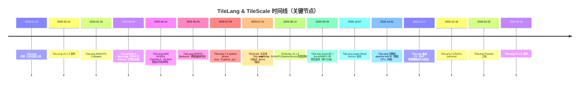
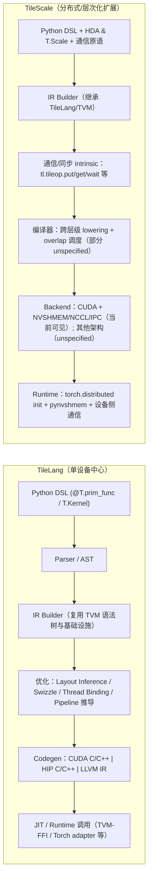

<!-- more -->

---

## 摘要

TileLang 是一个面向高性能 AI kernel 的 tile-level DSL + 编译器体系：用 Python 风格语法描述“tile 粒度的数据流与显式内存层级放置”，并通过编译器自动做布局推断（Layout Inference）、线程绑定/向量化、软件流水线推导与硬件相关 layout swizzling，最终生成 CUDA/HIP/LLVM 等后端代码，在 NVIDIA 与 AMD GPU 上追求接近（甚至超过）手写/库级实现的性能。其核心思想是“数据流与调度解耦”：用户主要描述数据流与关键约束，编译器探索/应用调度与硬件优化；当默认优化不足时再在前端精细干预。

TileScale 的定位是 TileLang 的“分布式扩展与层次化架构推广”：它将 tile-level 编程从单设备扩展到多 GPU、多节点，甚至“芯片内分布式”的下一代加速器形态，并提出分层分布式架构（HDA, Hierarchical Distributed Architecture）与统一“mega-device”抽象；在编程层面用一致的 tile-level compute/memory/communication 原语覆盖不同硬件层级，并强调计算-通信-内存访问的细粒度重叠与调度自动化。项目目前明确处于早期/实验阶段，白皮书尚未发布。

两者的关系可以概括为：**TileLang 更像“强 kernel 编译器/DSL”（单设备 + 多后端 + 丰富 kernel 库/原语）**；**TileScale 更像“把 kernel 编译器提升到分布式层次”的系统化尝试（层次化 scale、tile-level 通信与集体、跨设备/跨层级调度）**。工程上 TileScale 是从 tile-ai 的 tilelang 仓库分叉出来的分支线：社区问题中指出其与“主线 TileLang”在 2025-07-21 出现明确分歧点，并引出后续同步/合并的复杂性（TVM-FFI 迁移、TileOperator 重构等）。

下表给出面向大模型系统开发者最关心的“关键属性对比”（以 2026-02-26 公开信息为准；未知处明确标注 unspecified）。 

| 维度 | TileLang（tile-ai/tilelang） | TileScale（tile-ai/tilescale） |
|---|---|---|
| 目标尺度 | 单设备内（线程块/warp/tile），面向 kernel 库 | 多尺度层次化：线程/warp/SM/cluster/设备/节点（“mega-device”） |
| 核心抽象 | Tile Operator（Lower + InferLayout）、显式内存放置、布局推断、软件流水线 | HDA + `T.Scale`（分层 SPMD）+ tile-level 通信/集体 + 多层内存/网络抽象 |
| 通信/集体 | 主线以计算为主；分布式原语在论文中作为未来扩展方向 | 直接提供（或通过 NVSHMEM 风格原语搭建）put/get/signal/wait、all-to-all/allgather/allreduce 等示例与路线图 |
| 编译后端 | CUDA / HIP / LLVM IR；并在路线/新闻中出现 WebGPU、Metal、Ascend 等后端支持进展 | 以 CUDA 多 GPU（NVSHMEM/NCCL/IPC）为主；更广泛加速器后端属于愿景，细节多为 unspecified |
| 运行时 | JIT 调用为主，依赖 TVM 基础设施；采用 TVM-FFI 降低 host overhead | Python 侧用 torch.distributed 初始化 + NVSHMEM（pynvshmem）+ IPC/UVA；强调设备侧通信原语与同步 |
| 性能证据 | 论文与官方 benchmark repo 给出多 kernel 评测与 speedup 描述 | 官方 README/示例强调能力与范式；公开 benchmark 数字较少（示例脚本自带计时） |
| 成熟度与生态 | star/issue/版本发布频繁；文档站与学习材料（Puzzles）较完整 | 早期/实验；无 GitHub Release；同步主线与维护策略仍在讨论 |
| 适用选择 | 你要写/改“极致优化的单卡或单设备 kernel/算子库”，并追求多后端可移植 | 你要把“通信原语与 kernel 调度”一起纳入编译/表达，做细粒度通信-计算重叠或新型层次化并行 |

## 历史与时间线

关键仓库与文档入口（按用户要求给出可直接复制的 repo link）：

```text
https://github.com/tile-ai/tilelang
https://github.com/tile-ai/tilescale
https://github.com/tile-ai/tilelang-benchmark
https://tilelang.com/
https://arxiv.org/abs/2504.17577
https://openreview.net/forum?id=Jb1WkNSfUB
```

TileLang 的官方 README 给出“开源起点 + 重要功能节点”的时间线（例如 2025-01-20 开源、2025-02-12 发布 v0.1.0、后续加入 NVRTC/WebGPU/Metal/Ascend 后端、迁移到 apache-tvm-ffi、集成 Z3、加入 CuTeDSL 后端、上线 Puzzles 等）。
在版本演进上，TileLang 的主线版本文件显示为 0.1.8；GitHub Release 页面也显示 v0.1.8 发布于 2026-02-16。

TileScale 方面：其 GitHub Release 页面明确显示“暂无 releases”；但仓库本身有版本文件（当前为 0.1.7.post1），且在 2025-08-14 的 roadmap issue 中列出了 v0.1.0 的特性/内核计划（UVA copy、IPC handle、barrier/fence 原语、资源控制、语言层 `T.alloc`/`T.view` 等，以及 all-to-all/all-reduce、SUMMA/Cannon 等分布式模式）。
关于“分叉/分歧点”：一个公开 issue 将 TileScale 与“主线 TileLang”分歧点标注为 2025-07-21，并给出后续主线累积提交、API 变更（TVM-FFI、TileOperator 重构）及合并工作量的描述；这成为判断 TileScale 与 TileLang 维护关系的重要线索。

下面用 mermaid 生成一份“官方信息 + 关键工程事件”的合并时间线（日期均来自上述公开来源；未覆盖的细节标为 unspecified）。



## 设计目标、定位与适用场景

TileLang 的设计目标更偏“把写高性能 kernel 的工程复杂度从 CUDA 手搓转移到 DSL + 编译器”：论文给出明确问题陈述——在 Triton 等框架下，想扩展到 bespoke use case（尤其需要显式控制内存层级、定制流水线/调度）仍然困难；TileLang 的解法是以 tile operator 描述数据流、由编译器承担更多调度/优化推导，并允许专家在前端进一步控制线程行为与内存布局。 
在适用场景上，TileLang 官方 README 与论文评测都锚定在大模型常见 kernel：GEMM/Dequant-GEMM/FlashAttention/LinearAttention/MLA decoding 等，并强调在 NVIDIA 与 AMD GPU 上的性能与可移植性。

TileScale 的目标则显著更“系统/架构向”：README 将当前 AI 计算描述为“跨 intra-chip 与 inter-chip 的混合多级分布式架构”，并声称要把线程/PE/die/chip/node 等资源统一抽象成 HDA，对用户呈现一个虚拟 mega-device；在此基础上提供跨层级一致的 tile-level compute/memory/communication 原语，并由编译器调度并重叠通信、计算与内存访问。 
但 TileScale 同时明确：**技术白皮书尚未发布、项目处于早期实验阶段**，这对“是否用于生产/是否投入大规模重构”是关键约束。

选择建议（面向大模型开发者的现实决策）：

- 当你需要的是“单卡/单设备内极致优化 kernel（尤其是 fused attention / quantized GEMM / 自定义 layout 与流水线）”，并且希望跟随主线快速迭代、获得更好的文档/benchmark/社区反馈：更倾向选 TileLang。
- 当你的核心痛点是“把通信也当作 kernel 语义的一部分来编排”，希望把 all-to-all/allgather/allreduce 这类通信与算子融合、做细粒度 overlap、甚至探索 cluster/多层级并行的表达：TileScale 的模型更贴合，但要接受其维护/同步与工程稳定性的不确定性。

## 核心抽象与编程模型对比

TileLang 的核心编程模型可以分三层理解：

第一层是“kernel 外壳与并行域”：典型写法是在 Python 中用 `@T.prim_func` 定义函数，并在 `with T.Kernel(...)` 中指定 grid 维度、threads、以及 blockIdx 等语义；这与论文示例一致。

第二层是“显式内存层级的 tile buffer”：例如 `T.alloc_shared` 将 tile 放入 shared memory，`T.alloc_fragment` 将 tile 放入寄存器/fragment；配合 `T.copy / T.gemm / T.clear` 等 tile operator，构造数据流。  

第三层是“数据流导向 tile operator + 编译端推断接口”：论文明确要求 Tile Operator 具有 `Lower` 与 `InferLayout` 两个接口，分别负责 lowering 到更低层 IR（thread binding、vectorized load/store 等）以及推断 buffer/loop layout（包括 swizzle、thread binding 等）。这解释了为什么 TileLang 可以让用户“写数据流”，而把 thread-level 细节推到编译器里自动生成。

TileScale 在 TileLang 之上引入了分布式/层次化概念，关键抽象是：

- HDA：把 compute/memory/network 资源按层级组织（线程→warp→SM→cluster→device→node），并允许同层级单元通过网络互联（例如 NVLink/InfiniBand，或芯片内 NoC）。 
- `T.Scale`：用于选择“当前计算发生在什么层级”，并采用 SPMD 方式扩展到该层级的所有并行单元；同时可返回 rank/id 用于任务特化（warp specialization、warpgroup specialization 等）。 
- 分布式通信原语：README 给出 `T.copy(..., dst=...)`、`T.barrier()`、`T.allreduce()` 等示例；更底层的接口在仓库代码与示例中体现为 NVSHMEM 风格 put/get + 信号/等待 + fence/quiet 等。

下面用两段“最小示意代码”对比两者表达风格（均为简化伪代码；真实 API 以仓库为准）。

TileLang：单卡 GEMM 的典型骨架（与论文示例一致）

```python
import tilelang.language as T

@T.prim_func
def matmul(A, B, C):
    with T.Kernel(N // BN, M // BM, threads=128) as (bx, by):
        A_s = T.alloc_shared((BM, BK))
        B_s = T.alloc_shared((BK, BN))
        C_r = T.alloc_fragment((BM, BN))
        T.clear(C_r)

        for k in T.Pipelined(K // BK, num_stages=3):
            T.copy(A[by*BM, k*BK], A_s)
            T.copy(B[k*BK, bx*BN], B_s)
            T.gemm(A_s, B_s, C_r)

        T.copy(C_r, C[by*BM, bx*BN])
```

TileScale：把“设备级并行 + 设备级 allreduce”纳入同一 kernel 语义（示意）

```python
import tilelang.language as T

@T.prim_func
def tp_gemm_allreduce(A, B, C):
    with T.Kernel(device=(4), block=(..., ...), threads=256):
        with T.Scale("device") as dev_id, dev_num:
            # 每个 device 只算一部分（例如切 K 或切 N）
            C_partial = ...
            # 设备间归并
            T.allreduce(C_partial)
            # 写回全量/或写回分片
            ...
```

关键差异总结：TileLang 的“可控性”主要体现在单设备内存层级、线程映射、layout/pipeline 等；TileScale 在此基础上宣称把“网络/通信/同步”提升为 tile 原语，并把分布式资源纳入统一层次化编程模型。

## 编译与优化流水线

TileLang 编译流水线（以论文与文档为主线）可以抽象为：**Python → AST/IR Builder（复用 TVM 基础设施）→ Optimizations（layout inference、pipeline、tensorization、swizzle 等）→ Codegen（LLVM IR / CUDA C/C++ / HIP C/C++）**。论文给出明确的阶段图，并说明其 IR 构建/优化阶段与 TVM 的关系。
在关键优化上，论文披露了多个“自动化 pass”方向：layout inference（推断 fragment 布局、shared swizzle、thread binding、vectorization）、软件流水线推导（依赖分析与 num_stages 抽象）、动态参数简化与尾部循环分裂等。

另一方面，TileLang 的工程实现也在快速演进：README 的“Latest News”显示其已迁移到 `apache-tvm-ffi`（强调“显著降低 CPU overhead”）、集成 Z3 到 arith analyzer（SMT 推理增强优化与正确性验证）、加入 CuTeDSL backend（编译到 NVIDIA CUTLASS CuTe DSL）、加入 NVRTC backend（降低 cute 模板编译耗时），以及扩展到 WebGPU / Metal / Ascend 后端等。

这里的 TVM-FFI 值得单独说明，因为它直接影响“kernel 调用开销/框架互操作”：Apache TVM 官方把 TVM-FFI 定义为面向 ML 系统的 open ABI + FFI 约定，并强调可以“构建一个跨框架/跨语言复用的共享库”；其文档给出安装方式，quickstart 强调跨 PyTorch/JAX 等框架的互操作可能性。
此外，NVIDIA CUTLASS 的 CuTe DSL 文档也明确提到“启用 TVM FFI 可以减少 eager kernel invocation 的 host overhead，并改善与 ML framework 的互操作（直接接收 torch.Tensor 等）”，这与 TileLang 迁移 TVM-FFI 的动机一致。

TileScale 的编译流水线公开信息更少（白皮书未出）。README 给出的“系统总览”是：前端提供 tile 原语与 Python 绑定；中间层包含 compiler / tile kernels / cost model：compiler 负责 lowering 到 IR、执行优化 pass、并把高层原语降低为更低层原语（例如 block 级 GEMM 映射到预实现 kernel 或 lowering 到低层代码）；tile-kernel 模块维护原语实现库；cost model 构建性能数据库并为优化方案提供反馈；后端则允许用户定义符合 HDA 的可配置硬件架构，从而“编译到用户定义的架构”。
在“分布式通信如何进入 IR”这一点上，TileScale 仓库里可以看到更具体的 TIR 级 intrinsic 入口：`tilelang.language.distributed.common` 使用 `tvm.tir.call_intrin` 调用 `tl.tileop.put/get/wait` 以及 `tl.get_rank/get_num_ranks` 等 op；这表明通信原语至少在 IR 层已被建模为一类 tile operator/intrinsic（具体 lowering 到 NVSHMEM / 其他通信实现的细节属于部分 unspecified）。
工程依赖层面，TileScale 的 `pyproject.toml` 显示其同样依赖 `apache-tvm-ffi`、`z3-solver`，并在 Linux 上依赖 `nvidia-nvshmem-cu12`；这与其“设备侧 put/get 通信范式”保持一致。

下面给出一份“架构/IR 流”对比的 mermaid 示意图（根据公开描述抽象，TileScale 未公开部分以 unspecified 标注）。



## 运行时与分布式执行模型

TileLang 的运行时形态主要是“JIT 编译 + Python 调用”：论文示例中通过 `tilelang.compile(program, target="cuda")` 生成 kernel，并在 Python 中直接调用；其实现依托 TVM 基础设施并最终生成 CUDA/HIP 等后端代码。
在“跨框架互操作与调用开销”层面，TileLang 的依赖与新闻条目都指向 TVM-FFI：`pyproject.toml` 依赖 `apache-tvm-ffi` 与 `torch-c-dlpack-ext`；README 标注迁移到 `apache-tvm-ffi` 以减少 CPU overhead。

TileScale 则在公开代码中呈现出更明确的“分布式运行时拼装方式”：

- 初始化与进程组：`tilelang.distributed.utils.init_distributed`/`init_dist` 通过 `torch.distributed.init_process_group(backend="nccl")` 建立分布式上下文，并可创建 TP_GROUP/LC_GROUP；同时可选择初始化 NVSHMEM（`pynvshmem.init_nvshmem_by_uniqueid(TP_GROUP)`）。
- 设备侧通信：分布式示例直接在 kernel 中调用 `T.putmem_nbi_block`、`T.fence`、`T.signal_op`、`T.signal_wait_until`、`T.quiet` 等 NVSHMEM 风格原语来构建 allgather/all-to-all/序列并行 all-to-all 等。
- 内存与可见性：代码层面存在显式 fence 与 signal/wait；roadmap issue 也把“barrier primitives（signal/arrive）+ group barrier + memory fence primitives”列为核心特性之一，但正式的内存模型/一致性语义仍属于 unspecified（至少公开文档未给出形式化定义）。
- 拓扑/能力探测：工具函数包含 `supports_p2p_native_atomic()`（查询 CUDA P2P native atomic 支持）、`has_fullmesh_nvlink()`（通过 NVML 或 nvidia-smi topo 检查 NVLink fullmesh），并在非 fullmesh 情况下给出“可能导致未定义行为”的 warning；这说明 TileScale（至少在当前实现）对“同机多 GPU 拓扑”有较强假设/依赖。
- IPC/UVA：`create_dist_tensor` 通过收集 IPC handle 并同步到 GPU buffer ptr；源码注释指出“IPC 仅对通过 cudaMalloc 显式分配的 tensor 工作”（这对实现零拷贝/跨 GPU 指针访问很关键）。

因此，在“运行时与分布式执行模型”这一项上，两者差异很大：TileLang 把重点放在单设备 kernel 生成；TileScale 把通信原语（以及通信引起的同步/可见性）显式纳入 IR 与 kernel 表达，并辅以 NVSHMEM/NCCL/IPC 等运行时机制。

## 生态互操作、性能、局限与路线图

互操作性方面，TileLang 的“主线叙事”是借助 TVM 生态与 TVM-FFI 获得更好的调用路径与框架互操作：TVM-FFI 文档强调其 open ABI 允许“一个库跨多个框架/语言复用”，并列举 PyTorch/JAX 等框架；TileLang 本身也依赖 `apache-tvm-ffi` 并在新闻中强调迁移后降低 CPU 开销。
TileScale 的互操作则更直接体现在 PyTorch 分布式生态：示例用 `torch.distributed` 做参考实现（例如 `dist.all_gather_into_tensor`、`dist.all_to_all`），并用 NVSHMEM tensor 执行 TileScale/TileLang-dist kernel，最后对齐 PyTorch golden reference；这对大模型并行算子验证非常实用。
对于 TensorFlow/XLA 等框架：公开信息中 TileLang 生态更可能通过 TVM-FFI/通用 ABI 路径实现，但 TileLang/TileScale 仓库并未公开“官方 TF/XLA 集成层”细节，因此这里按用户要求标注为 unspecified。

性能证据方面，TileLang 的论文给出较丰富的对比结果（这里仅摘取对大模型开发者最相关的结论性陈述）：

- 在某些 chunk-state（来自 Mamba-2）函数上，相比 Triton 平均 speedup 可达 1.77× 与 2.10×。
- 多头 latent attention（MLA）在 H100 上相对 Torch 提到 1075.9×；并声称达到手写 FlashMLA 的最高约 98% 性能，同时代码行数约 70 行；在 MI300X 上相对 Torch 129.2×，并声称达到手写库 AITER 的约 95%（AITER kernel 未开源，LOC 未计）。
- Dequant matmul 方向，论文给出相对 cuBLAS/Marlin/BitsandBytes 的多组配置 speedup，其中最大 speedup 为 7.65×（BitBLAS-TileLang），并给出若干平均 speedup。

此外，OpenReview（ICLR 2026 Oral 页面）摘要级信息声称：TileLang 在 H100 上对 Triton 可达“最高 5×”加速，在 AMD GPU 上最高可到 6×（摘要层级信息，需以最终论文细节为准）。
官方 benchmark 仓库提供了 FlashAttention、GEMM、Dequant matmul 等结果图与 shape 列表，便于复现实验设置与对比。

TileScale 的性能公开证据目前更偏“示例可运行 + 对照计时”：例如 `example_allgather.py` 同时测量 `torch.distributed.all_gather_into_tensor` 与 NVSHMEM + TileScale kernel 的平均耗时（脚本运行时打印），并做数值一致性检查；但仓库 README 并未像 TileLang 那样集中展示可复用的 benchmark 图表，因此对外可引用的“固定数值”较少，按用户要求标注为 unspecified。
工程状态上，TileScale 仍存在安装/构建路径问题的用户报告（例如按安装指南 `pip install -e . --no-build-isolation` 触发错误），这也侧面反映其成熟度与环境兼容性挑战。

局限与已知问题（以公开 issue/描述为证据）：

- TileLang：存在与 CUDA 版本/类型定义相关的编译问题报告（例如 `__nv_fp8_e8m0` 在特定 CUDA 环境下未定义导致示例编译失败），以及对 Blackwell/新架构支持、TMA/布局推导等持续改进需求；这些问题在 issue 列表与 bug report 中可见。
- TileScale：无 releases；处于实验阶段；并且存在与主线 TileLang 的同步/维护策略不明确的问题（issue #46 讨论是否周期性同步 TVM-FFI 等主线更新，并提到 TileScale 分布式 TileOperators/语言原语需要随 API 迁移）。

路线图方面：

- TileLang：论文在结论里明确提出未来方向，包括（1）构建 self-hosting tile library，减少对 CUTLASS/手写 CUDA/HIP 的依赖；（2）扩展到分布式场景，引入 tile-level communication primitives 与调度策略；（3）研究 cost model；（4）扩展到更多后端（CPU/NPU 等）的通用化支持。
- TileScale：roadmap issue（v0.1.0）把 barrier/fence、资源控制（persistent threadblock / multi-stream）、以及多种分布式算法模式（Cannon/SUMMA、all-to-all、ag-gemm、gemm-rs）列为重要目标；README 则宣称将统一 intra-chip 与 inter-chip 分布式资源并自动优化 overlap，但白皮书“coming soon”。

## 面向大模型开发的实践指南与清单

这一节聚焦“你在大模型训练/推理里真正会实现的分布式算子与融合 kernel”，并对每个场景明确给出：**TileLang 怎么做** vs **TileScale 怎么做**，以及推荐的工程落地路径。

### 张量并行

TileLang 路径通常是“单卡 kernel + 框架集体”：你用 TileLang 写分片 GEMM / Attention / FFN kernel（例如切 N 或 K），然后在 Python/框架层调用 NCCL allreduce/reduce-scatter/allgather 完成 TP 聚合。这与 TileLang 当前“单设备中心”的定位一致。

TileScale 则试图把“TP 通信语义”也纳入 kernel：README 展示了 4-GPU TP GEMM 的例子：`with T.Scale("device")` 定义 device 级视图（FullRow/FullCol/Replica），在 block/warpgroup 层做计算与局部 allreduce，再在 device 层做全局 allreduce（并暗示不同内存层级 L1/L2 的通信与 overlap）。这类表达适合你想做“计算与通信深度融合”的场景（例如把 reduce-scatter 和 epilogue 融在一起）。

### 流水线并行

无论 TileLang 还是 TileScale，pipeline parallel 的“阶段切分、micro-batch 调度、激活传递”都更偏框架级执行图问题；两者更可能用于：**在每个 stage 内实现更快的 attention/ffn/optimizer kernel**（TileLang）或 **让跨 stage 的点对点通信更细粒度地 overlap**（TileScale）。公开资料未给出“内建 pipeline parallel runtime”，因此按用户要求记为 unspecified。

### 分片优化器与 ZeRO 类通信

TileLang：重点在 fused optimizer kernel（例如 fused AdamW update、fused grad scaling、FP8/INT8 状态更新等），通信（reduce-scatter/allgather）仍建议走框架/NCCL。TileLang 的强项在于你可以把 optimizer update 与一些 elementwise 融合并放进显式内存层级里优化。

TileScale：roadmap 明确把 “ag-gemm / gemm-rs” 这类“通信-计算耦合模式”作为目标之一，可视作对 ZeRO-3 类 reduce-scatter + GEMM 的编译表达诉求；同时其通信原语（put/get/signal/wait）使你有机会把 shard 同步/归并嵌入更底层的调度与 overlap。

### MoE all-to-all

这是 TileScale 当前最“可落地展示价值”的场景之一：仓库示例 `example_all_to_all.py` 的函数签名/参数（TOKEN_NUM、TOPK、HIDDEN、EXPERT_NUM、splits_cumsum、signal）以及实现方式（对每个 peer 执行 `putmem_nbi_block`，随后 fence，然后用 signal_op + signal_wait_until 做同步）基本就是 MoE token dispatch 的通信骨架。

TileLang 主线若要做 MoE all-to-all，通常仍需框架层通信（NCCL all-to-all / point-to-point），TileLang 负责 MoE expert 内部的 fused kernel（例如 fused linear + activation）。论文中把“分布式 tile-level 通信”列为未来扩展方向，恰好说明主线 TileLang 当前并不把它作为核心能力。

### Attention kernel 与融合算子

TileLang 在 attention/MLA 上有明显的公开性能与工程投入：README 给出 FlashAttention/FlashMLA/MLA decoding 等示例入口与 benchmark 图；论文评测也把 MLA 与 FlashAttention 作为重点 kernel，并讨论自动 async copy、在 Hopper 上 lowering 到 TMA 等优化方向。

TileScale README 也给出 “FlashMLA 的 4-GPU context parallelism”示例，展示了把 KV 沿 seq_len 分片到不同 device、并在 warpgroup 范围内做分块通信/拼接（通过 `T.copy(..., dst=...)` 表示跨 rank 传输）来完成 attention 数据流。这类表达对于“长上下文 + context parallel + overlap”是非常贴合的。

### 激活重计算与内存规划

两者共同点是都强调显式内存层级与 tile buffer 的生命周期管理：TileLang 通过 alloc_shared/alloc_fragment 等表达；TileScale 进一步把“可在不同 scale/view 下访问同一 tile partition”作为重要机制。
但激活 checkpoint 本身仍属于框架调度策略，公开资料未显示“由 DSL 内建 checkpoint pass”，因此建议把 DSL 的作用定位为：**让 checkpoint 前后复算核更快、让内存占用的关键 buffer 在更低层级更可控**（其余部分为工程推断，非官方承诺）。

### 两个可直接复用的“大模型通信-并行模板”

第一类：序列并行 all-to-all（prefill 前）  
`example_pre_attn_all2all.py` 给出一个完整 golden reference（PyTorch `dist.all_to_all` + reshape）与 NVSHMEM 实现：输入形状 `[B, NUM_HEADS, SEQ_PER_PE, D]`，输出 `[B, HEADS_PER_PE, SEQ_LEN, D]`，用 `putmem_nbi_block` 把“目标 PE 的 head shard”发往对端，并用 signal 统计 block 完成数。

第二类：反向 all-to-all + transpose（post-attention）  
`example_post_attn_all2all_transpose.py` 给出从 head-parallel 格式 `[B, HEADS_PER_PE, SEQ_LEN, D]` 转回 sequence-parallel `[B, SEQ_PER_PE, NUM_HEADS, D]` 的实现，并在设备侧循环 head chunk、用 `signal_wait_until` 等待所有 block 完成。这个模板在实际系统里常和 KV cache 重排/通信融合结合。

### 分布式算子实现的优先级清单

结合 TileScale roadmap（UVA/IPC/barrier/fence、ag-gemm、gemm-rs、all-to-all/all-reduce、SUMMA/Cannon）与示例代码实践，可给出一份“从能跑到能用”的优先级清单：

- 语义与接口层（P0）：先把通信算子的 **shape contract、分片方式、同步语义** 固化，并提供 PyTorch golden reference（示例已给出 all-to-all 与 reverse all-to-all 的 reference 写法）。
- 设备侧原语层（P0）：优先统一 `put/get + fence + signal/wait` 的最小集合，并明确哪些路径走 NVSHMEM、哪些走 IPC/UVA（roadmap 把 UVA copy + IPC handle 作为 v0.1.0 核心特性）。
- 调度与 overlap（P1）：把通信放入 `T.Pipelined` 或分层 `T.Scale` 结构中，目标是“通信遮蔽计算”或“计算遮蔽通信”（TileScale README 的系统目标就强调 overlap 与自动调度）。
- 性能与拓扑适配（P1）：在同机多 GPU 上加入拓扑探测与降级策略（仓库已有 fullmesh NVLink 检测与 warning），避免在非 fullmesh 情况下出现未定义行为或性能塌陷。
- 工程化测试与 CI（P0→P1）：把分布式示例固化为 pytest（仓库示例已有 `tilelang.testing.requires_distributed` 装饰器用法），并提供最小 2/4 GPU 的 correctness gate；性能回归可先用脚本打印耗时并记录阈值。
- 调试与剖析工具（P0）：利用 TileLang 的 `T.print`、layout plotter（README 提到提供 debug tools 与 layout plotter），以及内置 profiler（示例中 `kernel.get_profiler(...)` 与 `perf_fn` 计时函数），形成“可定位—可复现—可回归”的闭环。

### 推荐学习路径与开发者关注点

先从 TileLang 入手：用官方文档与 Puzzles 熟悉语法与常见 tile operator（尤其是 layout/pipeline/warp specialization），再去读论文的 layout inference 与 pipeline 推导章节，把“编译器会替你做什么/你需要显式标注什么”搞清楚。

随后再进入 TileScale：直接从 `examples/distributed` 的 allgather / all-to-all / seq-parallel all-to-all / reverse all-to-all 入手，把通信语义、信号同步、以及 NVSHMEM tensor 生命周期跑通；再对照 roadmap 把 UVA/IPC/barrier/fence 与 ag-gemm/gemm-rs 这些“真实训练关键路径”补齐。

最后强调一条现实约束：TileScale 公开信息明确其仍在早期阶段且白皮书未出，同时存在安装与主线同步策略的不确定性；因此在生产系统里更合理的策略往往是 **“用 TileLang 交付单设备 kernel 价值，用 TileScale 作为通信融合与新并行范式的实验场/候选实现”**。
