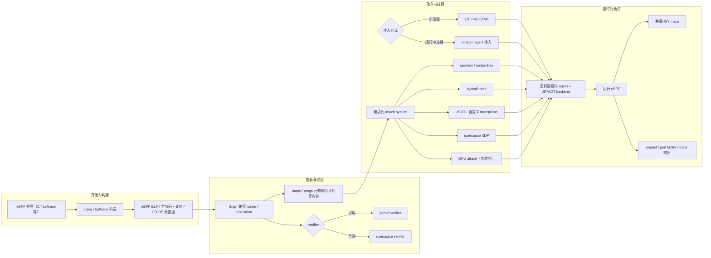

<!-- more -->

---

## 执行摘要

bpftime 是一个面向工程落地的 **userspace eBPF 运行时与通用扩展框架**。它不只是一个“在用户态执行 eBPF 的 VM”，而是把加载、校验、执行、数据通道、挂载点与工具链协作等能力一起搬到用户态，用来解决高频 userspace 观测与进程内扩展的问题。

从工程定位看，bpftime 主要想解决两类痛点：

1. 用户态可观测与用户态扩展，往往很容易在性能、可用性和安全之间互相牵制。
2. 传统 userspace eBPF VM 很难直接承接 clang/libbpf/bpftrace/BCC 这一整套现有生态。

它的核心思路不是“替代所有内核 eBPF”，而是把更适合用户态的那部分能力从内核路径中拿出来，通过共享内存 maps、用户态 attach、JIT/AOT 和对现有工具链的兼容，降低某些场景下的端到端开销。

工程上更合理的理解是：**bpftime 是用户态扩展和用户态观测的强力选项，而不是内核 eBPF 的通用替代品。**

## 定位、目标与生态关系

### 项目定位

bpftime 可以被看作“高性能 userspace eBPF runtime + 通用扩展框架”。它强调的不是单点能力，而是一整套用户态运行链路：

- 用 clang/libbpf 等方式生成或加载 eBPF 程序。
- 在用户态完成 verifier、loader、maps 和 helpers 协作。
- 将程序挂到 userspace 的 uprobe、USDT、syscall trace 等事件源上。
- 在需要时与内核 eBPF 协作，而不是强行二选一。

这和传统“只有 VM + 少量 maps/helpers”的 userspace eBPF 项目有明显区别。bpftime 想做的是更完整的 runtime，而不是单纯执行字节码。

### 与现有 eBPF 生态的关系

bpftime 的一个重要价值是尽量复用既有 eBPF 生态。原文中关于这一点的表达是成立的，但需要收敛一点：更准确的说法不是“完全兼容”，而是 **以兼容 clang/libbpf/bpftrace/BCC 风格工作流为目标，并在不少 userspace tracing 场景里提供可用路径**。

这意味着它的工程收益主要来自两点：

1. 已有的 eBPF 开发经验不必完全重学。
2. 一部分 userspace 观测与扩展场景可以避开内核路径的额外开销。

### 与 Wasm、bpftrace、内核 eBPF、传统 uprobes 的关系

- 与内核 eBPF 相比：bpftime 更适合用户态热点函数观测、进程内扩展、用户态故障注入，不适合替代 LSM、内核 tracepoint、in-kernel XDP 这类内核职责。
- 与 bpftrace 相比：bpftrace 是高层脚本工具，bpftime 更像承载 userspace attach 和执行的 runtime。
- 与传统内核 uprobes 相比：bpftime 的核心卖点在于尽量减少内核陷入和上下文切换成本。
- 与 Wasm runtime 相比：bpftime 的优势不在语言表达力，而在于更贴近 eBPF 工具链、观测场景和数据路径。

### 关键特性与适用性对比

| 方案 | 执行域 | 主要挂载/扩展点 | 生态关系 | 典型优势 | 典型代价 |
|---|---|---|---|---|---|
| bpftime | 用户态进程内，可与内核协作 | uprobe、uretprobe、USDT、syscall trace、部分 userspace XDP/GPU 场景 | 尽量复用 eBPF 工具链 | 高频 userspace 探针低开销，适合进程内扩展 | 注入、改写、权限治理复杂 |
| 内核 eBPF | 内核态 | kprobe、tracepoint、LSM、TC、XDP | 生态最成熟 | 系统级/内核级可观测与控制能力最强 | 权限门槛高，风险直接作用于内核 |
| bpftrace | 依赖底层 runtime | kprobe、tracepoint、uprobe 等脚本抽象 | 开发体验好 | 排障和快速验证效率高 | 能力和性能受底层 runtime 限制 |
| 传统内核 uprobes | 内核态 | userspace 函数入口/返回 | 与 Perf/eBPF 协同 | 覆盖广、接入经典 | 陷入内核和上下文切换开销明显 |
| Wasm runtime | 用户态沙箱内 | 通过 hostcall/ABI 扩展 | 与 eBPF 生态弱耦合 | 可移植性和隔离性通常更强 | 与现有 eBPF 工具链割裂，边界调用成本可能更高 |

## 架构与关键实现

从工程组件视角看，bpftime 的主路径可以概括为：

**编译/加载 -> 校验 -> 注入/挂载 -> 事件触发 -> 执行 eBPF -> maps/输出通道**

### 执行引擎

原文关于 runtime backend 的主线判断是合理的：bpftime 并不是只靠一个解释器，而是围绕 JIT/AOT 做性能路线。更稳妥的表达方式是：

- 常见构建路径会围绕 LLVM JIT/AOT 展开。
- 某些 backend 或实现路径是否默认启用，取决于版本和构建选项。
- 工程上应该把“版本 + 编译选项 + attach 类型”绑定起来看，而不是把文档中的能力列表直接当成所有构建的默认状态。

### loader、relocation 与 verifier

bpftime 的工程优势之一，是尽量沿用 libbpf 风格的加载与重定位思路。这让它更容易接住现有 eBPF 开发习惯。

verifier 部分，原文的判断基本准确，但需要避免绝对化：更合理的说法是 **优先复用内核 verifier，对齐内核 eBPF 行为；在没有内核 verifier 的条件下，再退到 userspace verifier**。这也是工程上更稳的上线策略。

### helpers、maps 与共享内存

bpftime 的 maps 设计很关键，因为它直接决定“用户态执行是否还能保持 eBPF 编程模型”。原文中强调的共享内存 maps、跨进程共享以及与内核部分协作，这些方向是对的。

需要修正的是表述强度：不是所有 map 类型、共享模式、helper 组合都应直接视为“稳定可生产使用”，实际要以你所使用版本的实现和文档为准。

### hook、注入与 attach system

原文这一部分是正文里最有价值的内容之一，应该保留。bpftime 的核心工程能力并不只在“执行 eBPF”，而在于：

1. 如何把 runtime 注入目标进程。
2. 如何把事件源做成模块化 attach system。
3. 如何在 userspace 中完成函数与 syscall 的拦截分发。

这里最重要的工程结论是：**bpftime 的可用性很大程度上取决于你的注入方式是否可控，以及系统安全基线是否允许。**

### 支持边界

原文提到的几个方向可以保留，但需要明确边界：

- `uprobe/uretprobe`、USDT、syscall trace 是它最核心的用户态能力。
- userspace XDP 适合作为扩展方向理解，但不应笼统地写成“等同于内核 XDP 能力”。
- GPU attach 可以保留为正文内容，但必须明确标注为实验性能力，不能写成成熟特性。

## 性能、安全与局限

### 性能结论应该怎么读

原文保留了很有价值的 micro-bench 数据，这部分不该删除。核心信息可以概括为：

- 在高频 userspace probe 场景下，bpftime 相比 kernel uprobe 可能有数量级优势。
- 这种优势首先来自“减少陷入内核与上下文切换”，而不是 eBPF 语义本身更快。
- 这种结论适用于特定 attach 路径和工作负载，不能外推为“所有场景都更快”。

下表保留原文中的代表性数据，便于博客阅读：

| 操作 | Kernel Uprobe 平均(ns) | Userspace Uprobe 平均(ns) | 量级差异 |
|---|---:|---:|---:|
| `__bench_uprobe` | 2561.57 | 190.02 | 约 13.5x |
| `__bench_uretprobe` | 3019.45 | 187.10 | 约 16.1x |
| `__bench_uprobe_uretprobe` | 3119.28 | 191.63 | 约 16.3x |

这些数据的工程含义很直接：如果观测点位于 malloc、TLS、RPC、中间件、语言运行时等高频 userspace 函数，内核路径本身就可能成为主要开销。

### “扩展框架”视角下的性能

原文里对 Nginx 模块扩展、Wasm/Lua 对比的讨论也应该保留，但需要收敛为工程表述：

- 可以说“在论文和官方材料的实验配置中，bpftime 展示出接近原生的吞吐表现”。
- 不应直接写成“bpftime 普遍优于 Wasm/Lua”。

更准确的结论是：**在宿主应用低开销扩展这一类场景里，bpftime 可能比更通用的沙箱扩展机制更贴近原生性能，但结果高度依赖 hook 点、helper、隔离策略和 workload。**

### 运行时成本与运维含义

原文提到的 trampoline 代价、动态注入延迟、Frida attach overhead 都值得保留，因为这些比“绝对性能更快”更接近真实上线问题。

这里的工程结论是：

1. 高频路径上，几十纳秒级额外成本也可能累积成明显尾延迟。
2. 动态 attach 到运行中进程，不只是一个技术问题，也是发布流程和权限治理问题。

### 安全边界

原文关于安全性的讨论方向是对的，但需要改成更克制的写法：

- bpftime 的确把“不受信任扩展代码”的主要爆炸半径从内核缩小到了用户态进程。
- 但它同时引入了新的高敏感操作面，例如 ptrace 注入、文本段改写、agent 注入、hook 链路治理。

因此不能简单下结论说“用户态就更安全”。更准确的结论是：

**它把风险形态从“内核风险”转成了“用户态进程风险 + 注入治理风险”。**

### 局限与不确定项

这一部分原文保留价值很高，建议继续明确写出来：

- API 和内部实现仍在演进，不宜把某个版本文档直接当成长期稳定契约。
- 某些 attach 能力、平台支持、GPU 路径、kernel-user 高性能共享结构等仍有明显边界。
- 某些 syscall trace 或架构相关能力受指令集、平台、构建方式限制。

## 部署运维、成熟度与未来方向

### 常见部署形态

原文对部署方式的划分合理，可以保留为三类：

1. **userspace only**：目标是高频用户态观测和进程内扩展。
2. **hybrid**：userspace 与 kernel eBPF 协作，各自负责更适合自己的 program type。
3. **library embedding**：只使用 runtime 的一部分能力，而不是引入完整注入链路。

这三种形态没有绝对优劣，关键是先明确你的 hook 点在哪里，再决定 runtime 形态。

### 构建与依赖

这部分原文信息应保留，但改成博客更适合的说法：

- bpftime 对编译器、LLVM、libbpf、容器环境和构建选项有明显依赖。
- 是否启用 userspace verifier、daemon、CUDA attach、某些 backend，往往由构建开关决定。
- 因此“能编过”和“生产可用”之间还隔着版本矩阵、环境矩阵和验证矩阵。

### 运行、调试与运维工具

原文提到的 `bpftime` CLI、`bpftimetool`、`bpftime-aot` 都值得保留，因为这恰恰体现了它不是单一 VM，而是完整 runtime 工具链。

工程实践中，比较有价值的动作包括：

- 用 `bpftimetool` 导出当前共享内存状态，做复现和排障。
- 用 JIT/AOT/不同 attach 方式做对照测试，找出性能回退来源。
- 在有条件时，把 userspace BTF、内核 verifier 和 CO-RE 路径结合起来，减少结构体漂移和运行时行为偏差。

### 成熟度判断

原文这部分保留方向是对的，但不宜写死某个具体版本结论。更稳妥的表述是：

- 官方仓库和文档长期都在强调项目仍处于活跃演进中。
- 这意味着它值得持续关注，但不适合在没有灰度、回滚和权限治理的条件下直接进入生产关键路径。

## 结论与实践建议

bpftime 的工程价值可以浓缩为一句话：

**当你希望复用 eBPF 生态，但主要观测点和扩展点在用户态，而且内核路径的开销或权限模型已经成为瓶颈时，bpftime 提供了一个更系统化的 userspace eBPF 方案。**

它真正吸引人的地方不是“能在用户态跑 eBPF”这件事本身，而是把 userspace attach、共享内存 maps、工具链兼容、JIT/AOT 与注入能力整合成了一条可工程化的路径。

与此同时，它也不是“零代价方案”：

- 注入与二进制改写会把运维复杂度拉高。
- 动态 attach 会受到系统安全基线约束。
- 某些能力仍在演进，不能对生产稳定性做过度乐观假设。

如果把这篇文章压缩成一份可执行建议清单，大致是下面 7 条：

1. 先判断你的 hook 点是不是主要在 userspace；如果不是，就不要强行用 bpftime 替代内核 eBPF。
2. 优先选可审计、可回滚的注入路径；新进程场景通常比动态 attach 更好治理。
3. 把 verifier 当成上线闸门，而不是可选项。
4. 对高频路径同时做微基准和业务基准，不要只看官方 benchmark。
5. 默认从“只读观测”开始，再逐步尝试 override、ureplace 这类会改变行为的能力。
6. 对 GPU、特殊 syscall trace、平台限定功能保持保守预期。
7. 在真正上线前，把权限模型、灰度、审计和回滚都设计完整。

总的来说，bpftime 值得研究，也值得在合适场景中认真试用；但它更适合被当成“受控引入的工程能力”，而不是“可以一步到位替换现有体系的银弹”。

## 参考资料

- 官方仓库：`https://github.com/eunomia-bpf/bpftime`
- 官方文档：`https://eunomia.dev/bpftime/`
- 项目介绍页：`https://eunomia.dev/bpftime/documents/introduction/`
- 使用文档：`https://eunomia.dev/bpftime/documents/usage/`
- benchmark 说明：`https://eunomia-bpf.github.io/bpftime/benchmark/uprobe/results.html`
