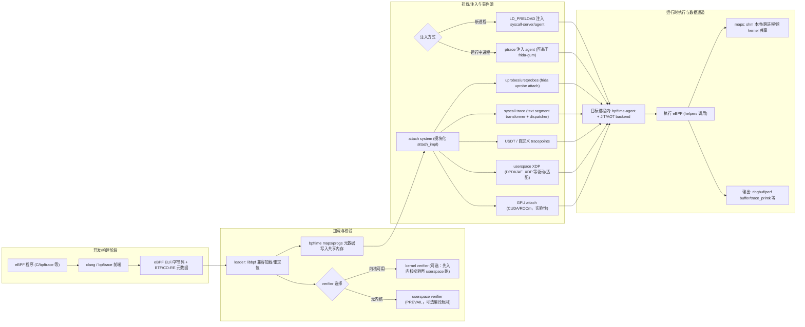

<!-- more -->

## 摘要

bpftime 是一个面向工程落地的 **userspace eBPF 运行时与通用扩展框架**：它不仅提供 eBPF 虚拟机（VM），更把从“编译/加载/校验/执行/数据通道/挂载点”到“与现有 eBPF 工具链协作”的整套能力搬到用户态，并强调可扩展的事件源（uprobes/USDT/syscall/XDP/GPU 等）与框架化集成。官方文档明确指出：bpftime 不是“单纯的 userspace eBPF VM”，而是包含 loader、verifier、helpers、maps、ufunc 与多种事件/扩展点的 userspace runtime framework，并提供多种 VM backend。

从定位上看，bpftime 主要解决两类工程痛点：其一是 **用户态可观测与用户态扩展** 在性能、可用性与安全之间的博弈；其二是 **既有 eBPF 生态（clang/libbpf/bpftrace/BCC 风格工具等）** 难以直接迁移到传统 userspace eBPF VM 的现实落差。它通过“绕过内核路径 + 优化 JIT/AOT（LLVM）+ 共享内存 maps + 动态注入/二进制改写式挂载”来降低某些场景，尤其是 userspace uprobe 与 syscall tracing 的端到端开销，并通过兼容 libbpf/clang 的加载与 CO-RE/BTF 机制降低迁移成本。

架构层面，bpftime 的关键工程选择可以概括为：
1. **执行在用户态**：将 eBPF program 与 maps 放入共享内存，由注入到目标进程的 agent 执行（JIT/AOT 后的本机代码或 JIT backend），典型挂载点由 uprobe/uretprobe、USDT、syscall trace 等组成。
2. **可“与内核 eBPF 协作”**：根据场景在 userspace 与 kernel 之间分工，例如 userspace 处理 uprobes/syscalls，kernel 处理 kprobe/tracepoint/XDP 等，并支持与 kernel maps 的一定程度共享。
3. **动态注入与二进制改写**：对运行中进程可通过 ptrace 注入；对新启动进程可通过 LD_PRELOAD 注入；并以二进制改写/inline hook 构造 trampoline，实现函数与 syscall 的拦截分发。

性能证据方面，官方 micro-bench 给出 userspace uprobe 相对 kernel uprobe 的数量级收益：示例数据中 `__bench_uprobe` 平均延迟从约 2562ns 降至约 190ns，约 13.5 倍，`__bench_uretprobe` 与组合探针也在 16 倍左右。在更偏“扩展框架”的评估中，bpftime 被用于 Nginx 模块化扩展对比（WebAssembly/Lua/RLBox/ERIM 等），图中 bpftime 的 RPS 接近原生基线，优于 Wasm 与 Lua 方案。同时，论文也披露了隐藏式扩展入口（concealed entries）的 trampoline 代价约 84ns/次，以及对空扩展调用的微基准拆解。

安全与权限模型上，bpftime 的核心思路是 **把“运行不受信任代码”的爆炸半径从内核缩小到用户态进程**，并用 eBPF 风格 verifier（可复用内核 verifier，或在无内核 verifier 时启用 userspace verifier，例如 PREVAIL）约束扩展行为。但它也引入了新的攻击面与运维约束：ptrace 注入、文本段改写、注入 agent 共享库与 hooks 本身，都要求更精细的权限控制与基线加固，例如 Yama 的 `ptrace_scope` 对 ptrace 能力的约束。

成熟度方面，官方主页与仓库均提示 bpftime 正在 **活跃开发并向 v2 重构**，API 可能不稳定，需要谨慎用于生产关键路径；仓库发布版本仍处于 0.x。工程实践上，更建议把 bpftime 视为：在“高频 userspace 观测点/插件化扩展/可复用 eBPF 生态”场景下的强力选项，而非对内核 eBPF 的通用替代。

## 定位、目标与生态关系

**项目定位与目标（官方口径）**：bpftime 被定义为“高性能 userspace eBPF runtime 与通用扩展框架”，覆盖观测、网络、GPU 与更一般的用户态扩展，并通过绕过内核路径与 LLVM 优化获得性能收益。官方强调它的目标包括：性能（bypass kernel、LLVM JIT/AOT）、跨平台/低权限环境可用性、以模块化设计快速扩展新的事件源与 program type、以及尽可能保持与内核 eBPF 及其工具链（clang/libbpf/bpftrace）的一致性与兼容性。同时，OSDI'25 论文把 bpftime 放在“userspace 应用扩展框架”的语境中，提出与 EIM（Extension Interface Model）结合，用 eBPF-style verification、硬件隔离（如 Intel MPK）与动态二进制改写实现“更安全、更高效”的扩展执行模型。

**与 userspace eBPF VM 的区别**：传统 userspace eBPF 项目常停留在“VM + 少量 maps/helpers”，难以直接复用内核 eBPF 生态的 loader、CO-RE、bpftrace/BCC 工具链；LPC 演讲材料也将此作为 bpftime 的动机之一，并强调 bpftime 是“full-featured runtime”，不仅是 VM。作为对照，bpftime 官方也将“仅 VM”形态指向 llvmbpf。

**与既有 eBPF 工具链/生态的关系**：bpftime 的策略是“尽量不改你的 eBPF 开发方式”。简介与示例文档宣称其可直接运行未修改的 bpftrace 脚本，并支持一批 BCC/libbpf-tools 风格的 userspace tracing 工具；OSDI'25 论文还报告在不改代码的情况下测试了 17 个 BCC 与 bpftrace 工具，并讨论了与 bpf-conformance 的兼容对比。在 CO-RE/BTF 方面，bpftime 文档给出通过 libbpf 的 `btf_custom_path` 注入“用户态应用的外部 BTF”，并指出 libbpf 不区分 BTF 来自内核还是用户态，从而通过合并 BTF 解决 userspace 结构体/函数类型漂移问题。

**与 Wasm、bpftrace、内核 eBPF、传统 uprobes 的关系（工程视角）**：
- bpftime 更像“把 eBPF 作为 **通用插件语言与观测语言** 延伸到用户态”，并将挂载点做成可插拔 attach system。
- bpftrace 是高层脚本工具，bpftime 的价值在于提供“让 bpftrace 及 BCC 风格工具在用户态执行/挂载”的运行时与兼容层。
- 与内核 eBPF 相比，bpftime 在 userspace 场景可减少内核陷入与上下文切换开销，但对内核级 hook（LSM、内核 tracepoint、TC/XDP in-kernel）并不能替代；bpftime 也提供与内核协作模式而非完全取代。
- 与传统内核 uprobes 相比，bpftime 的核心卖点是“在用户态实现 uprobe/syscall hook”，避免 kernel uprobe 路径的额外开销；相关博文解释了 kernel uprobe 通过断点陷入内核并带来明显 overhead。

**关键特性与适用性对比表（摘要版）**：表内结论为工程归纳，具体能力以实际版本文档为准。

| 方案 | 执行域 | 主要挂载/扩展点 | 复用 eBPF 生态（clang/libbpf/bpftrace） | 隔离与安全边界 | 典型优势 | 典型短板/代价 |
|---|---|---|---|---|---|---|
| bpftime | 用户态进程内（可与内核协作） | uprobe/uretprobe、USDT、syscall trace、userspace XDP、GPU attach 等 | 强调兼容；支持运行 bpftrace/BCC 风格工具；支持 CO-RE/BTF 扩展到 userspace | 主要把风险限制在用户态进程；依赖 verifier；可选 MPK 等 | 高频 userspace 探针低开销；可做热补丁/错误注入/插件化扩展 | 注入/改写带来运维与安全面；平台/架构与特性覆盖仍在演进；API 稳定性风险 |
| 内核 eBPF | 内核态 | kprobe/tracepoint/LSM/TC/XDP 等 | 生态最成熟（bpftool、libbpf、CO-RE/BTF 等） | 失败/漏洞影响内核；能力受权限与 verifier 限制 | 全系统/内核级可观测与控制；网络数据面高性能 | 权限门槛高；攻击面与内核风险更大；某些 userspace 探针路径 overhead 更明显 |
| bpftrace（工具） | 依赖内核 eBPF（或 bpftime runtime） | 高层脚本抽象覆盖 kprobe/tracepoint/uprobe 等 | 易用、快速迭代 | 取决于底层 runtime（内核或 bpftime） | 快速定位问题、低开发成本 | 性能与能力受底层 runtime、脚本模型限制 |
| 传统内核 uprobes | 内核态（对 userspace 函数插桩） | userspace 函数入口/返回 | 与内核 eBPF/Perf 生态协同 | 内核路径 + 断点陷入 | 全系统范围（同 ELF/同进程族）探针方便 | 探针命中带来陷入与上下文切换；更难做进程内“扩展/替换”语义 |
| Wasm runtime（泛指） | 用户态（沙箱内） | 通过 hostcall/ABI 扩展 | 与 eBPF 生态弱耦合 | 强沙箱（取决于实现） | 可移植、语言丰富、隔离强 | hostcall/边界检查可能引入额外开销；与 eBPF 工具链割裂 |

以上对比中，bpftime 的“扩展框架能力”在 OSDI'25 评估里体现为对 Nginx 模块扩展的吞吐对比，bpftime 接近基线吞吐，Wasm/Lua 等更低，并讨论了 bpftime 在效率与安全折中上的设计点。

## 架构与关键实现

本节以工程组件视角梳理 bpftime 的核心路径：**编译/加载 -> 校验 -> 挂载/注入 -> 事件触发 -> 执行 eBPF -> maps/输出通道**。bpftime 的整体设计可参考 OSDI'25 中的 “bpftime Design” 图，其中明确出现：libbpf loader、verifier、JIT compiler、syscall interposition、binary rewriter、bpftime maps，以及 userspace runtime 与 kernel runtime 的协作路径。

**userspace eBPF runtime（执行引擎）**：安装/构建文档显示 bpftime runtime 支持 LLVM JIT，默认 ON，要求 LLVM >= 15，并注明 uBPF interpreter “不再维护”因此推荐 LLVM，同时也保留 uBPF JIT backend 作为可选项；此外还提供 `bpftime-aot` 工具把 eBPF 字节码 AOT 编译为本机 ELF，并支持输出 LLVM IR 以便调试与优化分析。这些信息表明 bpftime 的执行后端在工程上至少覆盖：JIT（LLVM/uBPF）与 AOT（LLVM）。

**loader / relocation（与 libbpf 的协作方式）**：llvmbpf 文档说明 loader 使用 libbpf 完成 map relocation，并在加载与重定位完成后可用 bpftimetool dump maps 与字节码；同时举例说明 maps 既可通过 `bpf_map_lookup_elem` 等 helpers 访问，也可作为全局变量直接访问。这与“尽量复用内核 eBPF 开发形态”的目标一致。

**verifier（内核/用户态双实现与 BTF 扩展）**：bpftime manual 明确建议优先使用内核 verifier，以保持与内核 eBPF 对齐；并提供 `BPFTIME_RUN_WITH_KERNEL=true` 让程序“加载进内核进行校验”；当内核 verifier 不可用时，可在构建时启用 `ENABLE_EBPF_VERIFIER` 使用 userspace verifier，文档点名 PREVAIL。更进一步，bpftime 的 CO-RE 文档与教程展示了把 userspace 应用的外部 BTF 注入 libbpf，通过合并 userspace BTF 与 kernel BTF，使 CO-RE/类型校验扩展到 userspace 结构体访问与资源函数约束。

**helpers 与 maps（用户态数据结构与跨边界共享）**：bpftime 的 “Available kernel features in userspace” 页面列出当前支持的 shared memory maps 类型（HASH/ARRAY/RINGBUF/PERF_EVENT_ARRAY/PERCPU_* 等），以及 user-kernel shared maps（HASH/ARRAY/PERCPU_ARRAY/PERF_EVENT_ARRAY），并列出一批常用 helpers（map CRUD、perf_event_output、ringbuf reserve/submit、probe_read/write_user、ktime、trace_printk、get_current_pid_tgid 等）。OSDI'25 论文进一步描述 bpftime maps 通过拦截 eBPF map syscalls 来保持生态兼容，并支持三种共享模式（进程本地/跨进程/跨进程+内核），以及更丰富的数据结构（包括 LPM trie、ring buffer、perf event arrays、per-CPU variants 等）。注：两者列表存在“论文更宽、文档更保守”的差异，工程上应以你使用的版本与构建选项为准；若具体 map type 未在你版本的文档或代码中出现，应视为“未公开/不确定”。

**hook/注入机制（ptrace/frida-gum/二进制改写）**：
- “How it works” 文档明确：hook 基于 binary rewriting，userspace function hook 参考 frida-gum，syscall hooks 参考 zpoline 与 pmem/syscall_intercept；运行时注入既可基于 ptrace，也可由 frida-gum 提供。
- LPC 幻灯片进一步把注入方式总结为两类：运行中进程用 ptrace（基于 Frida），新进程启动时用 LD_PRELOAD；并给出 mode 1（userspace only）结构示意，包括 bpftime-syscall.so、verifier、bpftime-agent.so、JIT、共享内存 maps/progs 等。
- attach system 文档把挂载点实现模块化：`frida_uprobe_attach_impl`（支持 uprobe/uretprobe/override/ureplace）、`syscall_trace_attach_impl`（text segment transformer + syscall dispatcher，最多 512 slots）、`nv_attach_impl`（CUDA/GPU），以及 `simple_attach_impl` 等，并给出 syscall trace 的工作流说明。

**USDT/Uprobe/syscall/XDP/GPU 支持边界**：示例与特性页显示 bpftime 支持 uprobe/uretprobe、syscall tracepoints、USDT，并展示 `bpf_override_return` 等“改变控制流/返回值”的能力；同时注明 “attach all syscall tracepoints（当前 x86 only）”。userspace XDP 方面，示例文档列出 “XDP in Userspace” 与 “Use DPDK with userspace eBPF to run XDP seamlessly”，并强调同一 XDP 程序可跑在 kernel 与 userspace、无需修改且可支持 maps；另有 userspace-xdp 项目说明其使用 bpftime 作为 userspace eBPF runtime，并以 DPDK/AF_XDP 作为底层网络栈。GPU 方面，bpftime 文档说明通过 CUDA/ROCm attach 使 eBPF 在 GPU kernel 内执行，但明确标注“仍为实验性”。

## 性能、安全与局限

**已公布性能数据与解读（以“探针/挂载开销”为主）**：bpftime 性能文档的 micro-bench 示例显示，在一台 Linux 6.11 环境中，核心 uprobe/uretprobe 的平均延迟从约 2.5 到 3.1 微秒（kernel uprobe）降至约 0.19 微秒（userspace uprobe），提升约 13 到 16 倍。同页还给出部分 map 操作对比，例如 array map update：kernel 平均约 12.2 微秒，userspace 平均约 4.63 微秒，说明 bpftime 在某些 map 操作上也可能获得显著优势，但并非所有操作都更快，例如 array map lookup 在该示例中 userspace 平均更高。

**性能/延迟对比图表（来自官方 micro-bench 示例）**：单位 ns，越低越好。

| 操作 | Kernel Uprobe 平均(ns) | Userspace Uprobe 平均(ns) | 官方给出的加速比 |
|---|---:|---:|---:|
| `__bench_uprobe` | 2561.57 | 190.02 | 13.48x |
| `__bench_uretprobe` | 3019.45 | 187.10 | 16.14x |
| `__bench_uprobe_uretprobe` | 3119.28 | 191.63 | 16.28x |

示意柱状图，Kernel=`█`，Userspace=`▏`，同一行按 1 个 `█` 约 100ns 粗略缩放：
- uprobe：Kernel `██████████████████████████` vs Userspace `▏▏`
- uretprobe：Kernel `███████████████████████████████` vs Userspace `▏▏`
- uprobe+uretprobe：Kernel `████████████████████████████████` vs Userspace `▏▏`

对工程师而言，这类数据的关键含义是：当你的观测点在 **高频用户态函数**，如 malloc、TLS/HTTP2 库、语言运行时，上，内核 uprobe 的陷入/切换成本可能成为主要负担，而 bpftime 的设计目标就是把这部分成本压到“进程内 hook + userspace 执行”的量级。

**更接近“扩展框架”视角的性能证据**：OSDI'25 的 Nginx 模块评估图显示，在该实验配置下 bpftime 的吞吐接近 Baseline C 与 Native，且高于 WebAssembly 与 Lua；论文文本还对 Deepflow、Redis durability tuning 等用例给出额外数据与讨论。这些证据支持一个工程推断：bpftime 在“对宿主应用做低开销扩展”的场景，可能比 Wasm/Lua 等更接近原生性能，前提是 hook 点、helpers、隔离配置与 workload 形态与论文相近。

**运行时/挂载的细粒度成本与运维含义**：论文披露 concealed extension entries 需要 trampoline，增加约 84ns/次扩展执行；并给出“注入加载延迟”量级，示例中把扩展加载到运行中进程约 48ms，对比 LD_PRELOAD 约 30ms。attach system 文档也给出 Frida uprobe 的单次 probe overhead 约 10 到 100ns 的工程估计。这些信息对 SRE/性能工程的意义是：
- 若扩展入口命中频率极高，纳秒级敏感，trampoline/上下文准备可能成为主导成本。
- 若你追求“动态挂载到运行中进程”，需要把注入延迟、权限与可观测性纳入发布流程设计。

**安全考量：bpftime 降低了什么风险，又引入了什么风险**：
- **降低的风险（相对内核 eBPF）**：把 eBPF 扩展的主要执行域从内核移到用户态，可减少内核攻击面；这也是 bpftime 与相关研究动机之一。在更广泛背景下，学术与业界长期关注内核 eBPF 的内存安全与攻击面问题，例如 SafeBPF 等研究聚焦在“隔离内核 eBPF”。
- **新增的风险与攻击面**：bpftime 需要对目标进程进行注入与二进制改写/文本段变换，属于高敏感操作面；ptrace 本身允许“观察与控制其他进程、读写寄存器与内存”，因此常被系统加固策略重点限制。Linux 的 Yama LSM 通过 `kernel.yama.ptrace_scope` 收紧“同一用户进程间互相 ptrace”的默认能力，旨在降低凭据窃取与横向移动风险，这会直接影响 bpftime 的“attach 到运行中进程”能力边界。
- **权限模型的工程结论**：bpftime 的示例中，动态 attach 需要 sudo，至少在默认系统策略下，而 LD_PRELOAD 模式通常要求你能控制目标进程启动环境。如果你还需要与内核 eBPF 协作，如 kprobe/tracepoint/XDP 等，则会重新落入内核 eBPF 的 capability/权限模型，因此“完全无特权”并非所有部署都成立。

**局限与“未公开/不确定”项**：
- **版本与特性覆盖**：主页提示正在向 v2 重构，API 可能不稳定。
- **平台支持**：attach system 文档给出 Linux 全支持、macOS 仅 Frida 相关 attach、Windows 未支持；这与“跨平台目标”并不矛盾，但意味着跨平台落地仍有距离。
- **架构/指令集限制**：示例文档注明 “trace all syscalls（目前 x86 only）”。
- **GPU**：文档明确 GPU 支持仍为实验性；相关开销、稳定性、隔离模型在公开资料中尚不足以给出通用结论，在本文中应视为“未公开/不确定”。
- **跨 kernel-user 共享 hash map 的高性能实现**：LPC 幻灯片列出开放问题：`BPF_F_MMAP` 当前主要用于 array，如何实现高性能的 kernel-user 共享 hash map 等。

## 部署运维、成熟度与未来方向

**部署形态与边界选择（先决策再落地）**：bpftime 至少存在三种常见工程化落地方式：
1. **userspace only（mode 1）**：将 runtime（syscall-server/agent）注入目标进程，事件源主要是 uprobe/USDT/syscall trace；maps/progs 存于共享内存，适合做高频 userspace 观测与进程内扩展。
2. **userspace 与 kernel 协作（hybrid）**：部分程序类型在 userspace 执行，部分如 kprobe/tracepoint/XDP 等进入内核运行；仓库 issue 描述了 daemon 将不同 program 装载到“合适 runtime”的模式。
3. **作为库嵌入（library）**：示例文档提到可仅使用 VM/JIT/AOT 作为库而不引入完整 runtime 与 uprobe。

**构建与依赖（官方给出的可复现路径）**：
- 官方提供容器镜像用于构建与测试；并给出 Ubuntu 上依赖安装列表，如 libelf、clang、llvm、boost 等，与推荐编译器版本。
- 构建选项覆盖 LLVM JIT、userspace verifier、是否启用 libbpf、是否构建 daemon、是否启用 MPK、CUDA attach 等，体现 bpftime 的“可裁剪/可移植”取向。

**运行与注入（最小可行路径）**：
- CLI `bpftime` 用于注入 agent/server 到 userspace 程序；构建文档列出安装后工具包括 bpftime、bpftimetool、bpftime_daemon 等。
- 使用方式上，仓库 `usage.md` 明确 CLI 本质是 `LD_PRELOAD` 的封装，并可结合 ptrace 向运行中进程注入共享库；示例展示 `bpftime load`、`bpftime start`、`bpftime attach <pid>` 的典型流程。
- 共享内存 maps 的容量可通过环境变量配置，例如 `BPFTIME_SHM_MEMORY_MB`，以避免大 map 导致内存不足。

**调试与可观测（运维工具链）**：
- `bpftimetool` 可导出/导入共享内存中的 programs/maps/links 到 JSON，用于排障、复现与状态快照；还支持在 JIT/AOT/INTERPRET 模式下运行并做性能测量。
- `bpftime-aot` 可把 eBPF 程序编译为本机 ELF，或输出 LLVM IR，并支持从共享内存中直接编译已重定位的程序，方便做离线分析与启动时延优化。
- 对 userspace 结构体访问与安全验证，建议在有条件时把 userspace BTF 与内核 BTF 合并走 kernel verifier/CO-RE 流程，以便获得更强的类型/边界校验与可移植性。

**成熟度与活跃度（公开信号）**：
- 官方主页提示处于活跃开发并向 v2 重构，API 可能不稳定。
- 仓库 release 仍为 0.x，并在 release note 中持续加入 maps、ringbuf、CUDA/GPU、CI 与 attach 相关改进。
- 论文与演讲材料也列出若干开放问题，例如高性能 kernel-user 共享 hash map、错误传播模型、unprivileged eBPF type、安全模型等，意味着在“通用化/产品化”道路上仍有研究与工程空间。

## 结论与实践建议

bpftime 的工程价值可以浓缩为一句话：**当你希望复用 eBPF 生态，但你的主要观测/扩展点在用户态、且内核路径开销或权限模型成为瓶颈时，bpftime 提供了一个“进程内 userspace eBPF 执行 + 共享内存 maps + 模块化 attach + 可选与内核协作”的系统化方案**。公开基准显示其在 userspace probe，尤其 uprobe/uretprobe，上可获得数量级收益；而在“应用扩展框架”用例中，也展示了接近原生的吞吐表现，并在论文中系统讨论了与 WebAssembly/Lua 等方案的效率差异。

与此同时，bpftime 并非“无代价”：它需要注入与二进制改写，涉及 ptrace/文本段修改等高敏感能力；在默认加固系统上可能被 `ptrace_scope` 等策略限制；并且项目仍处在 v2 重构与 0.x 版本阶段，接口与行为存在演进风险。因此，工程落地应以“边界清晰、逐步扩张、强治理”为原则。

**可直接复制的实践建议清单（操作步骤/注意事项）**：

1. **先做场景分类**
   你的 hook 点主要在 userspace，例如 TLS、语言 runtime、业务函数，优先评估 bpftime userspace only。
   强依赖内核级 hook，例如 LSM、内核 tracepoint、in-kernel XDP，以内核 eBPF 为主，bpftime 仅作为补充或混合部署。

2. **选定注入策略并固化权限模型**
   新进程可控：优先 LD_PRELOAD，便于控制与审计。
   必须动态挂载：评估 ptrace 注入在你的发行版与加固基线下是否可行，明确 Yama `ptrace_scope` 策略与审计要求。

3. **把 verifier 当作“上线闸门”**
   能用内核 verifier 就用内核 verifier，例如 `BPFTIME_RUN_WITH_KERNEL=true`，并把 userspace BTF/CO-RE 接入流程以减少结构体漂移风险。
   无内核 verifier 环境：启用 userspace verifier，如 PREVAIL，并建立“同版本回归测试 + bpf-conformance”策略，若适用。

4. **用 bpftimetool 做“现场取证/可复现”**
   线上问题：先 `bpftimetool export state.json` 固化共享内存状态，再做进一步排查。
   回归测试：用 `bpftimetool run` 在 JIT/AOT/INTERPRET 间对照，定位性能回退来源。

5. **对高频路径做两层基准**
   微基准：对照官方 uprobe micro-bench 的量级，判断是否值得切换 runtime。
   宏基准：用真实业务流量与延迟分位，例如 p95/p99，验证 hook 点与 maps 输出通道，例如 ringbuf/perf，是否造成尾延迟抖动。

6. **明确“不确定/实验性”能力的隔离边界**
   GPU attach 当前标注为实验性，仅建议在可回滚环境验证，并把故障域限制在非关键链路。
   kernel-user 共享 maps 的高性能 hash 等仍属开放问题，避免在性能关键路径上做不可逆绑定。

7. **上线策略建议（最小风险路径）**
   从“只读观测”开始，例如统计、采样、日志，再逐步启用 override/ureplace 这类“改变行为”的扩展能力，并把变更纳入灰度与回滚。
   若需要与内核 eBPF 协作，提前梳理 CAP_BPF、CAP_PERFMON、CAP_NET_ADMIN 等 capability 分配与运行时隔离，如容器/宿主策略。
